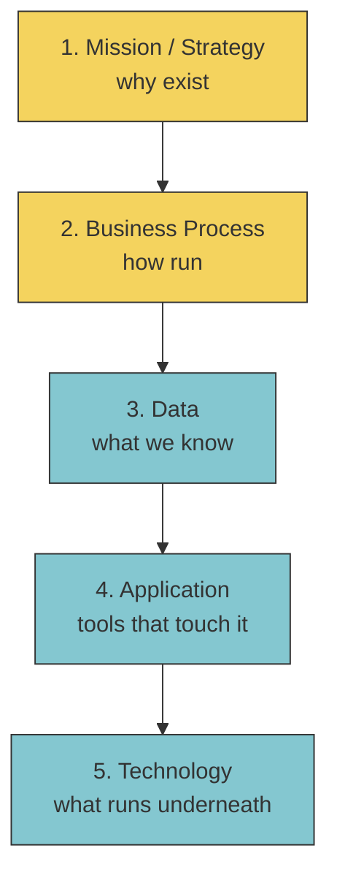
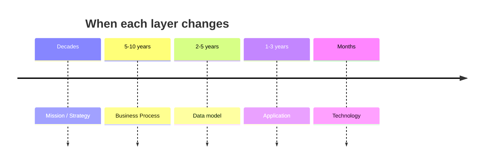

Five layers, top down.

```
1. Mission / Strategy       ◄── why does the org exist
2. Business Process         ◄── how does it run
3. Data                     ◄── what does it know     ┐
4. Application              ◄── what tools touch it    │ course focus
5. Technology               ◄── what runs underneath  ┘
```

Each layer constrains the one below. Strategy says "go global" --> processes need follow-the-sun --> data must be replicated globally --> apps must be region aware --> tech needs multi region cloud.

! Higher layers change less often. Tech swaps every few years. Mission lasts decades.

## Course focus
Bottom three: **Data + Application + Technology**. That's where [[Big Data]] forces redesign.

Top two (strategy, business process) come from MBA territory. Touched in `Watson_2014` via the "[[Predictive Analytics|business need]]" requirement.

See [[Enterprise Architecture]] for the framing, [[Big Data]] for the disruption.

## Visual


Blue = course focus.



## Learn more
- Wikipedia: [Enterprise architecture framework](https://en.wikipedia.org/wiki/Enterprise_architecture_framework)
- [TOGAF](https://www.opengroup.org/togaf) - the most-cited EA framework
- [Zachman Framework](https://en.wikipedia.org/wiki/Zachman_Framework)

