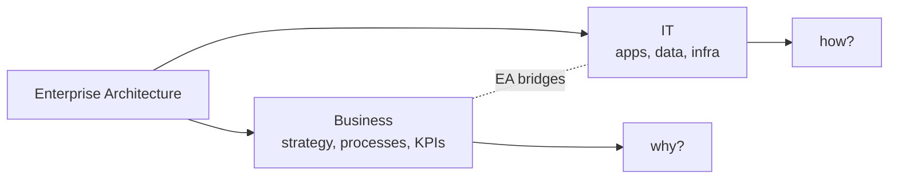
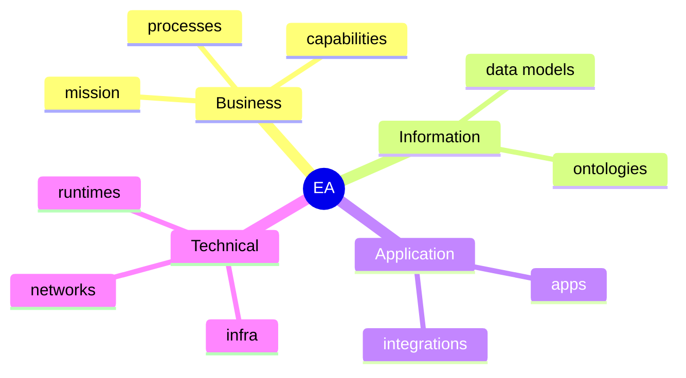

"Structure with a vision."

Architecture at the level of a whole organisation. Bridges **business and IT**. Avoids siloed view: information, product, process, application, technical architectures all connected.

## Definition (IEEE 1471-2000)
> "fundamental organization of a system embodied in its components, their relationships to each other, and to the environment, and the principle guiding its design and evolution"

Fundamental = what wouldn't change without rebuilding the thing.

## Why care
- Mergers, regulation, new tech --> need a map of what you have.
- Without EA: every team picks its own DB, format, language. Integration cost explodes.
- With EA: principles + standards = cheaper change.

## Course lens
Course focuses on [[EA Hierarchy]] bottom three layers: **Data, Application, Technology**.

! Big Data architecture is just EA when the data layer becomes the hard part. Volume, velocity, variety break the old recipes.

See [[Big Data]] for why those layers got hard. See [[Generations of Data Management]] for the historical arc.

## Visual - bridge model



## Visual - viewpoints



## Learn more
- Wikipedia: [Enterprise architecture](https://en.wikipedia.org/wiki/Enterprise_architecture)
- [TOGAF](https://www.opengroup.org/togaf) - the dominant EA framework
- [Zachman Framework](https://en.wikipedia.org/wiki/Zachman_Framework) - the original 6x6 grid
- Ross, Weill + Robertson, *Enterprise Architecture as Strategy* - the modern textbook


```
business --- EA bridges --- IT
   ▲                          ▲
   │                          │
"why?"                    "how?"
```
