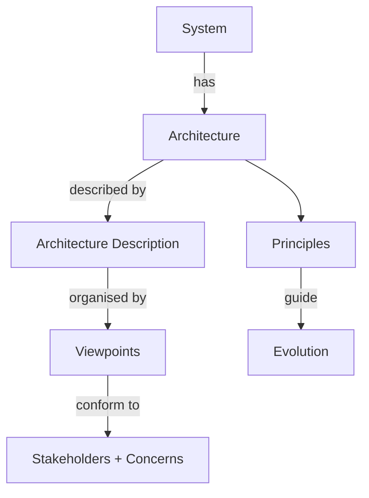

IEEE Standard 1471-2000. Canonical definition of architecture used in [[Enterprise Architecture]].

> "fundamental organization of a system embodied in its components, their relationships to each other, and to the environment, and the principle guiding its design and evolution"

Decompose:
- **fundamental organization** = the structure that does not change without rebuild
- **components + relationships** = boxes + arrows
- **environment** = users, regulators, neighbouring systems
- **principles** = the rules used to make future decisions

! The principles bit is what separates EA from "we drew some boxes." Without principles you have no way to tell if a new component fits.

Now ISO/IEC/IEEE 42010 (the update). Same idea, more rigor on stakeholders and viewpoints.

## Visual - the model

## Learn more
- [ISO/IEC/IEEE 42010 spec page](https://www.iso.org/standard/74393.html)
- Wikipedia: [ISO/IEC/IEEE 42010](https://en.wikipedia.org/wiki/ISO/IEC/IEEE_42010)
- [Free explainer at iso42010.org](http://www.iso-architecture.org/ieee-1471/)

