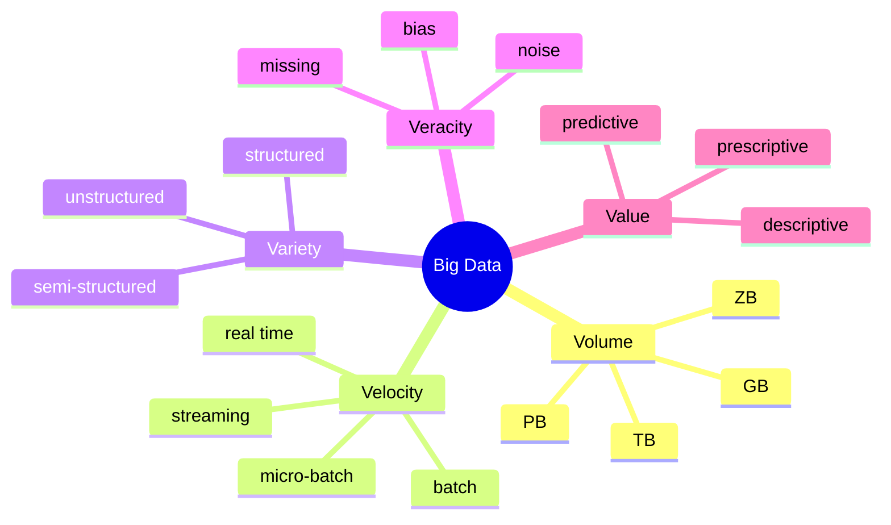

The OG Big Data framework. Original three (Volume, Velocity, Variety) from Gartner 2001. Veracity + Value added later.

| V | Question | Course note |
|---|----------|-------------|
| [[Volume]] | how much? | GB --> PB --> ZB |
| [[Velocity]] | how fast? | batch vs stream |
| [[Variety]] | what shape? | structured, semi, unstructured |
| [[Veracity]] | can I trust it? | noisy, missing, biased |
| [[Value]] | who cares? | turn it into money or insight |

! [[Value]] is the most important V. Without it the others are storage costs.

## Why a checklist
Architects use the Vs to pick stack pieces:
- High Volume --> [[MPP]], scale out, [[HDFS]]
- High Velocity --> [[Stream Processing]], [[Kafka]], [[CEP]]
- High Variety --> [[NoSQL]], schema on read, [[HDFS]]
- Low Veracity --> [[Heuristics]], probabilistic models, voting
- Hidden Value --> [[Descriptive Analytics]] --> [[Predictive Analytics]] --> [[Prescriptive Analytics]]

! In practice you rarely hit max on all five. Match the stack to whichever Vs dominate.

## Visual

## Learn more
- Wikipedia: [Big data](https://en.wikipedia.org/wiki/Big_data)
- Gartner glossary: [The 3 Vs (original)](https://www.gartner.com/en/information-technology/glossary/big-data)
- IBM: [The 5 V's of Big Data](https://www.ibm.com/think/insights/the-5-vs-of-big-data) - quick intro
- [[Watson 2014]] - the architecture survey that adds Value as the 4th/5th V

