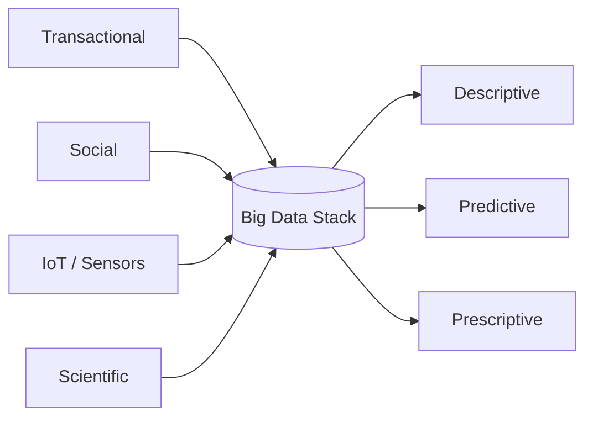

Two definitions, pick one.

## 1. Technology based
More and different data than is easily handled by traditional RDBMS / data warehouses. Operational definition: when the old stack breaks, you're in Big Data.

## 2. Vs based
The [[5 Vs]]: [[Volume]], [[Velocity]], [[Variety]], [[Veracity]], [[Value]].

! [[Value]] is the only one that matters at the budget meeting. Storing data creates zero business value. Analysing + acting does.

## Sources of bigness
- transactional (every click, every order)
- social (tweets, posts, comments)
- machine generated (sensors, logs, metrics, IoT)
- scientific (sequencing, telescopes, particle detectors)

## Big Data does not mean "lots of data"
Course rule: data does NOT have to be big for our project. Architecture is the point.

[[Watson 2014|Watson]] calls Big Data the **fourth generation** of decision support data management. See [[Generations of Data Management]].

The intellectual motivation is [[Unreasonable Effectiveness of Data]]. At web scale, dumb models win.

## Visual

## Learn more
- Wikipedia: [Big data](https://en.wikipedia.org/wiki/Big_data)
- McKinsey 2011 report: [Big data: The next frontier for innovation, competition, and productivity](https://www.mckinsey.com/capabilities/mckinsey-digital/our-insights/big-data-the-next-frontier-for-innovation) - origin of the 1.5M manager shortage stat
- Doug Laney 2001 (Gartner) - original 3 Vs memo, [PDF mirror](https://blogs.gartner.com/doug-laney/files/2012/01/ad949-3D-Data-Management-Controlling-Data-Volume-Velocity-and-Variety.pdf)
- Course paper: [[Watson 2014]] - architecture tour

