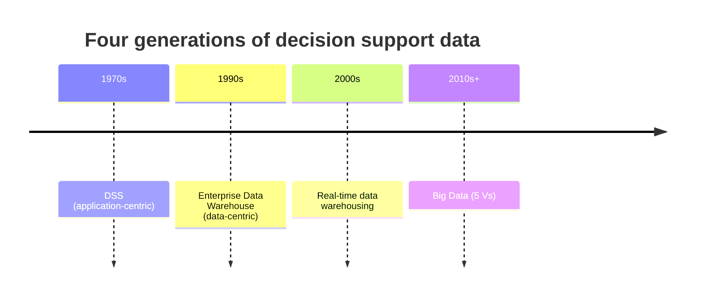
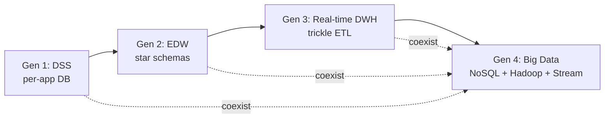

Watson 2014's framing. Four generations of decision support data infrastructure.

| Gen | Era | Approach | Centred on |
|-----|-----|----------|------------|
| 1 | 1970s | DSS | the application |
| 2 | 1990s | Enterprise [[Data Warehouse]] | the data |
| 3 | ~2000 | Real time warehousing | the latency |
| 4 | Today | [[Big Data]] | the [[5 Vs]] |

! Each gen does not replace the prior. They coexist. Most orgs run all four at once.

## What changed each gen
- **Gen 1** - one app, one DB, custom reports. No integration.
- **Gen 2** - star schemas, ETL, [[Descriptive Analytics]]. "Single source of truth."
- **Gen 3** - trickle ETL, micro batches. Dashboards stop being a day behind.
- **Gen 4** - [[NoSQL]], [[Hadoop]], [[Stream Processing]], cloud. Schema on read. Petabytes.

The course argument: gen 4 is where the team project lives. Pick the stack that matches your dominant Vs (see [[Big Data]]).

## Visual

Each gen layered on top, none retired.

## Learn more
- Kimball + Ross, *The Data Warehouse Toolkit*
- Inmon, *Building the Data Warehouse*
- [[Watson 2014]] - the original framing

