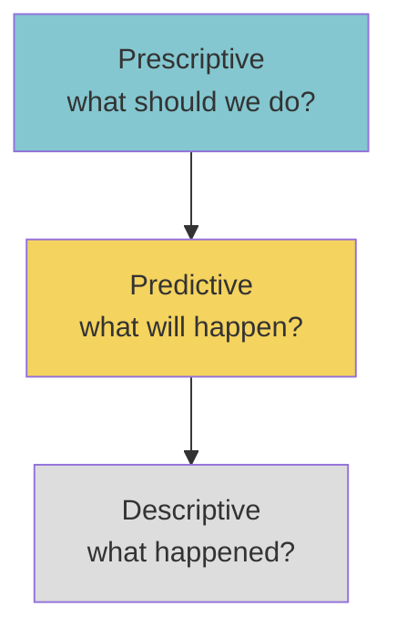
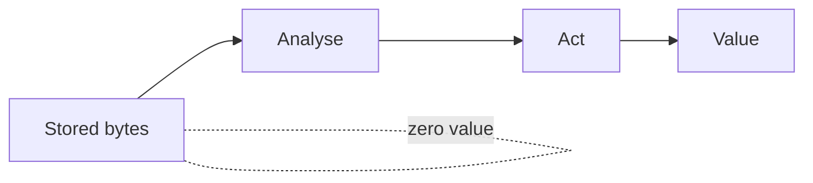

The V that pays for everything.

> "Storing data creates no business value. Only analysing and acting on it does." - [[Watson 2014|Watson]]

## Value extraction ladder
1. [[Descriptive Analytics]] - what happened
2. [[Predictive Analytics]] - what will happen
3. [[Prescriptive Analytics]] - what should we do

Orgs usually mature in this order. Skipping is hard because each step assumes the prior infrastructure works.

## Cases ([[Watson 2014]])
- **Starbucks** - blog/Twitter monitoring during launch, found "too expensive" signal in hours, dropped price same day.
- **Chevron** - 50TB seismic analysis, oil hit rate 1-in-5 --> 1-in-3, each miss saved ~$100M.
- **U.S. Xpress** - 900+ truck sensors, distinguishing idle types saved millions in fuel.
- **Target** - pregnancy prediction (25 variables). Worked. PR backlash --> now mixes in unrelated coupons.

! Without a clear [[Predictive Analytics|business need]], every other V is just expensive bytes. Watson's #1 success factor.

## Visual - the value pyramid

## Learn more
- Davenport + Harris, *Competing on Analytics* - case-heavy book
- [Target pregnancy story (NYT)](https://www.nytimes.com/2012/02/19/magazine/shopping-habits.html) - the canonical case
- See [[Watson 2014]] for more cases

