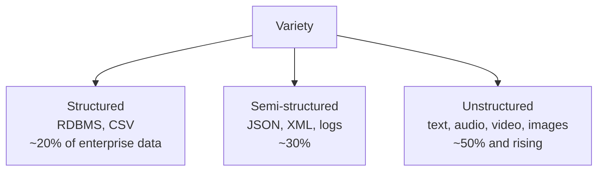
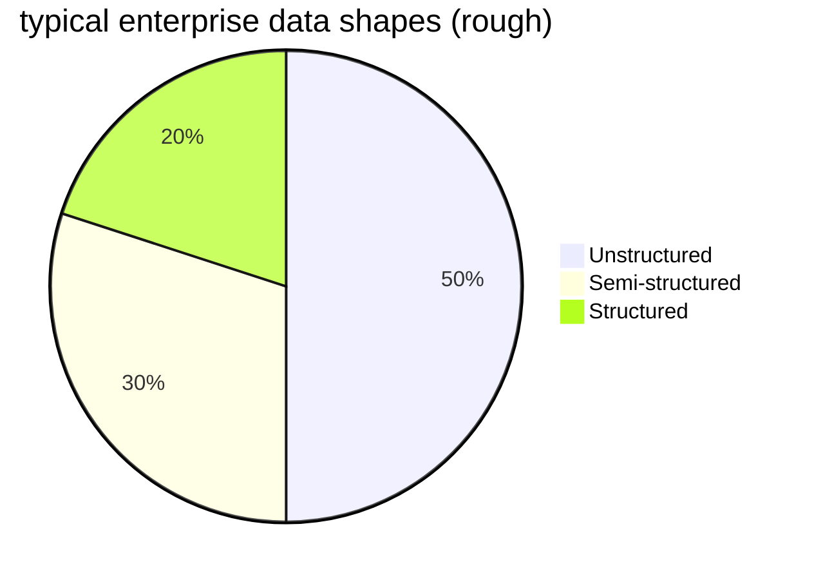

Shape of the data.

| Type | Examples | Storage |
|------|----------|---------|
| Structured | RDBMS rows, CSV | [[Data Warehouse]], SQL |
| Semi structured | JSON, XML, Avro | [[NoSQL]], doc stores |
| Unstructured | text, audio, video, images | [[HDFS]], object storage |

! Most enterprise data is now semi or unstructured. Old RDBMS first instinct ("normalise everything") falls apart.

## Architectural response
- schema on read instead of schema on write
- [[NoSQL]] - key value, document, columnar, graph
- [[HDFS]] - stores any file, no schema enforced
- separate transformation layer that maps wild data to clean schemas

See [[Halevy Norvig Pereira]] for why web tables (millions of arbitrary schemas) are useful raw material.

## Visual

## Learn more
- IDC: ["80% of data is unstructured"](https://blogs.idc.com/2023/05/29/the-state-of-unstructured-data/) - widely cited stat
- [Apache Iceberg](https://iceberg.apache.org/) - table format for mixed data on object stores

