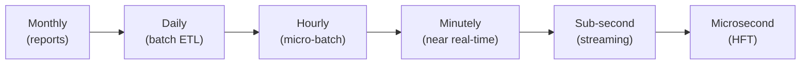
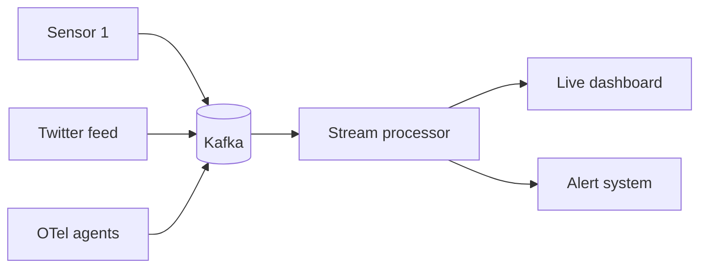

Rate at which data arrives. Plus rate at which decisions need to be made on it.

## Stream sources
- logs, click streams
- social media firehose (Twitter, news feeds)
- RFID, smart metering
- sensors, telemetry ([[OpenTelemetry]])

## Patterns
- **Daily** - batch overnight, classic [[Data Warehouse]] load
- **Seasonal** - Black Friday, tax day, World Cup
- **Event triggered** - news breaks --> stock moves --> trading system reacts in microseconds

## Architectural response
- [[Stream Processing]] - one source, continuous
- [[CEP]] - many sources, correlate
- [[Kafka]] - durable log, replay, fan out
- [[Lambda Architecture]] vs [[Kappa Architecture]] - batch + stream, or just stream

! Velocity is where the OTel project lives. Tracing data is the textbook high-velocity, high-cardinality stream.

## Visual - latency ladder

## Learn more
- [Apache Kafka](https://kafka.apache.org/)
- [Flink Use Cases](https://flink.apache.org/what-is-flink/use-cases/)
- See [[Stream Processing]]

