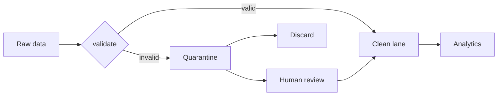
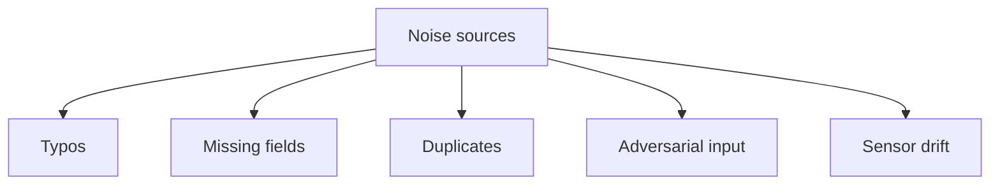

Can you trust the data?

## Why low veracity is the default at scale
- spelling errors, typos
- missing fields, nulls
- duplicates, near duplicates
- adversarial input (spam, bots, fake reviews)
- sensor drift, broken devices

## The Halevy comeback
[[Halevy Norvig Pereira|Halevy et al]] argued size beats noise. Brown Corpus 1M words (clean) vs Google 1T words (noisy). The noisy mountain wins for many tasks.

! But not for all tasks. Medical, legal, financial --> noise has a price tag. Veracity matters more in regulated domains.

## Architectural response
- validation at ingestion (dlt, Great Expectations)
- versioning + lineage (track where this row came from)
- probabilistic dedup
- voting / ensembling ([[Banko and Brill]] §4)

See [[Heuristics]] for why you can't insist on clean data when n is huge.

## Visual

## Learn more
- [Great Expectations](https://greatexpectations.io/) - validate data at ingest
- [dlt schema evolution](https://dlthub.com/docs/general-usage/schema-evolution) - the framework you're using
- [Halevy 2009](https://static.googleusercontent.com/media/research.google.com/en//pubs/archive/35179.pdf) - size beats noise (sometimes)

