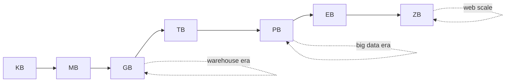
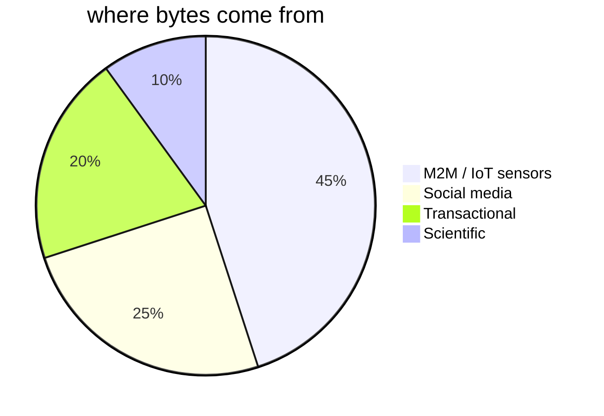

How much data. Bytes ladder:

```
KB → MB → GB → TB → PB → EB → ZB → YB
                ▲        ▲
              big      huge
        (warehouse)  (web scale)
```

## Sources
- transactional databases (orders, clicks, payments)
- social media streams
- M2M / sensor / IoT (often the biggest by raw byte count)

## Architectural response
- partition + parallelise --> [[MPP]]
- store cheap, compute later --> [[HDFS]], object storage
- columnar compression --> [[Columnar Database]]

! Volume alone is the easiest V. Throw money at storage. [[Velocity]] + [[Variety]] are harder.

## Visual





## Learn more
- IDC Data Age 2025 report - global datasphere projections
- [Latency Numbers Every Programmer Should Know](https://gist.github.com/jboner/2841832)

