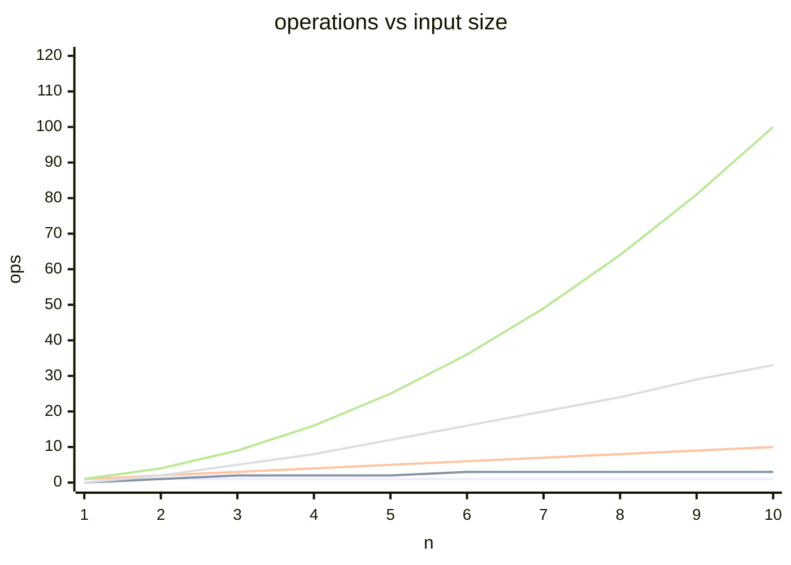

Set of functions with equivalent asymptotic growth. The ruler that ignores constants and lower order terms.

## Formal
`f(n) ∈ O(g(n))` if `lim(f(n)/g(n)) = c` with `c < ∞`.

Translation:
- limit is finite --> same growth order
- limit --> ∞ --> f grows FASTER than g
- limit --> 0 --> f grows SLOWER than g

## Common collapses
- `2n`, `100n`, `n+1` --> all `O(n)`. Constants gone.
- `4n² + 10n + 1` --> `O(n²)`. Lower terms gone.

## Sibling notations
- **O** - worst case, upper bound
- **Θ** - tight bound, average case
- **Ω** - best case, lower bound

! In job interviews "Big O" almost always means worst case O. In papers Θ is often the right one.

See [[Complexity Classes]] for the menu, [[Time Complexity]] for examples.

## Visual - growth comparison

## Learn more
- Wikipedia: [Big O notation](https://en.wikipedia.org/wiki/Big_O_notation)
- [Big-O Cheat Sheet](https://www.bigocheatsheet.com/) - everyone keeps this open during interviews
- MIT OCW: [Introduction to Algorithms (6.006)](https://ocw.mit.edu/courses/6-006-introduction-to-algorithms-spring-2020/)
- 3Blue1Brown adjacent: search YouTube for "Big O notation visualised"

