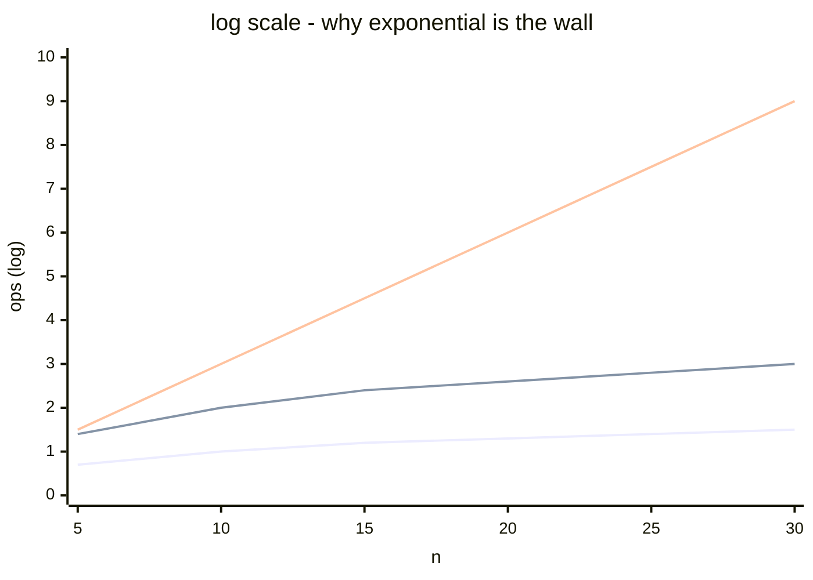

The standard menu, fastest to slowest.

| Class | Name | Example |
|-------|------|---------|
| O(1) | Constant | array index access, dict lookup |
| O(log n) | Logarithmic | binary search, balanced BST find |
| O(n) | Linear | scan an unsorted list |
| O(n log n) | Log linear | merge sort, FFT |
| O(n²) | Quadratic | bubble sort, all pairs shortest path |
| O(n³) | Cubic | naive matrix multiply |
| O(2ⁿ) | Exponential | brute force password, subset enumeration |
| O(n!) | Factorial | all permutations, TSP brute force |

! Anything `2ⁿ` or worse is unusable at real scale. n=30 already crushes a laptop. n=60 needs the heat death of the universe.

## Sanity numbers (n = 1,000,000)
- O(1) - instant
- O(log n) - ~20 ops
- O(n) - 1M ops, milliseconds
- O(n log n) - 20M ops, still milliseconds
- O(n²) - 10¹² ops, hours
- O(2ⁿ) - lol no

This is why [[Heuristics]] exist. See also [[Big O]].

## Visual - the cliff edge

At n=30 only O(2ⁿ) has crossed into "your laptop dies" territory.

## Learn more
- [Big-O Cheat Sheet](https://www.bigocheatsheet.com/) - data structures + sort algorithms
- [VisuAlgo](https://visualgo.net/) - animations of every classic algorithm
- Wikipedia: [Time complexity](https://en.wikipedia.org/wiki/Time_complexity)
- Skiena, *The Algorithm Design Manual* - the standard reference, Ch 1-2

