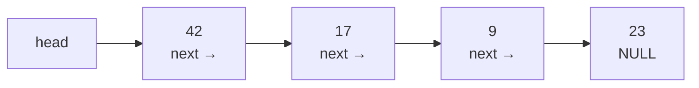
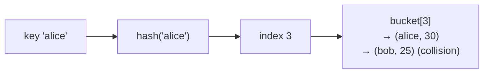
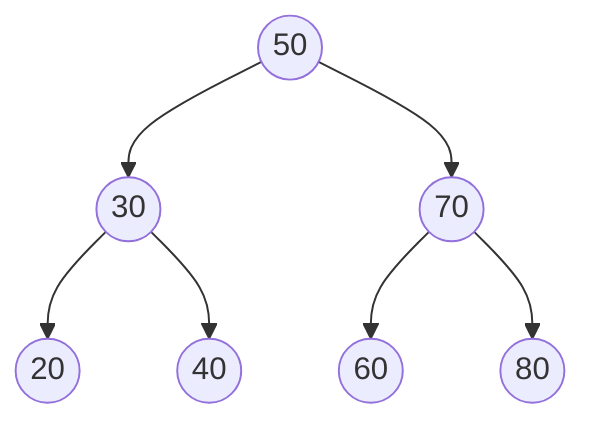

Composition of data + methods + internal organisation = abstract data types.

## The classics
- **Array** - contiguous, O(1) index access
- **Dictionary / Hash map** - key --> value, O(1) average lookup
- **Linked List** - pointer based, order independent of memory layout. Singly / doubly / circular.
- **Stack** - LIFO. `push`, `pop`, `peek`
- **Queue** - FIFO. `enqueue` (rear), `dequeue` (front)
- **Binary Search Tree** - keyed nodes, left subtree ≤ node ≤ right subtree. Search O(log n) IF balanced.

## Why this matters in EA
Picking the wrong data structure inflates [[Time Complexity]] by an entire class:
- using a list where you needed a dict --> O(n) lookups instead of O(1)
- using a dict where you needed an ordered list --> can't binary search
- using SQL where you needed a graph DB --> 17 joins

! [[Columnar Database]] and [[NoSQL]] are basically "we picked a different data structure at the storage layer."

## Visual - Array

```
index:  0    1    2    3    4    5
       ┌────┬────┬────┬────┬────┬────┐
value: │ 42 │ 17 │ 9  │ 23 │ 8  │ 11 │
       └────┴────┴────┴────┴────┴────┘
       ▲
       contiguous memory
       arr[3] = base + 3 * sizeof(int)  → O(1)
```

## Visual - Linked List


No contiguous memory. Follow pointers. Random access = O(n). Insert at head = O(1).

## Visual - Hash Map / Dictionary


Average O(1) lookup. Worst case O(n) if all keys hash to same bucket.

## Visual - Stack (LIFO) and Queue (FIFO)

```
Stack (LIFO)              Queue (FIFO)

push → ┌───┐               ┌───┐ ┌───┐ ┌───┐ ← enqueue (rear)
       │ 3 │ ← top         │ A │ │ B │ │ C │
       ├───┤               └───┘ └───┘ └───┘
       │ 2 │               ▲
       ├───┤               dequeue (front)
       │ 1 │
       └───┘

pop returns 3              dequeue returns A
```

## Visual - Binary Search Tree


Left subtree ≤ node ≤ right subtree. Search O(log n) when balanced. O(n) when degenerated into a line.

## Visual - operation cost cheatsheet

| Op | Array | Linked List | Hash Map | BST (balanced) |
|----|-------|-------------|----------|----------------|
| Access by index | **O(1)** | O(n) | n/a | O(log n) |
| Search by value | O(n) | O(n) | **O(1)** avg | **O(log n)** |
| Insert at end | O(1) amortised | O(n) (need tail) | **O(1)** avg | O(log n) |
| Insert at front | O(n) | **O(1)** | n/a | O(log n) |
| Delete | O(n) | O(1) if you have ref | **O(1)** avg | O(log n) |
| Sorted iteration | O(n log n) | O(n log n) | O(n log n) | **O(n)** |

! Picking the wrong one is one of the easiest ways to ruin performance. See [[Complexity Classes]].

## Learn more
- [VisuAlgo](https://visualgo.net/) - ANIMATIONS of every data structure operation. Best single resource.
- [Big-O Cheat Sheet](https://www.bigocheatsheet.com/) - same table, more structures
- [Python Data Structures (real python)](https://realpython.com/python-data-structures/)
- Skiena, *The Algorithm Design Manual* - the textbook, Ch 3 covers DS
- 3Blue1Brown YouTube: [search "hash table"](https://www.youtube.com/results?search_query=hash+table+visualised) for the geometric intuition

