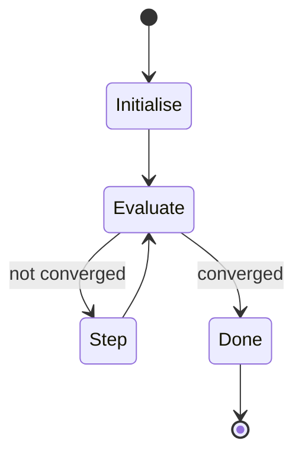

Algorithms that find a GOOD answer fast, not THE BEST answer slowly.

! When brute force is in [[Complexity Classes|O(2ⁿ) or O(n!)]] you have no choice.

## Why data mining lives here
- iterating over all possible models is usually infeasible
  - all decision trees on m binary attributes = doubly exponential
  - all clusterings of n points = Bell number territory
- so we use gradient descent, greedy search, random restart, simulated annealing
- typical shape:
  ```
  while not converged:
      do_something()
  ```

## The two questions
1. **How fast does it converge?**
2. **What does each iteration cost?**

Iteration cost * iterations = total time. Both must be tractable.

## Examples in the wild
- **k means** - iterate, assign points, recompute centroids
- **gradient descent** - iterate, compute gradient, step
- **EM** - iterate, expect, maximise
- **page rank** - iterate, propagate, normalise

! No guarantees of global optimum. Just guarantees of "good enough fast enough." Most real ML is heuristics under the hood. See [[Unreasonable Effectiveness of Data]] for why heuristics + lots of data still wins.

## Visual - gradient descent intuition

```
       loss
        │     ╱╲
        │    ╱  ╲       ╱╲
        │   ╱    ╲     ╱  ╲
        │  ╱      ╲   ╱    ╲
        │ ╱        ╲_╱      ╲___
        │           ▲ start
        │        ▼ step downhill
        │     ▼  step downhill
        │  ▼ ...
        │ ★ converged (local min)
        └─────────────────────────► parameters
```



## Learn more
- [3Blue1Brown: Gradient Descent](https://www.youtube.com/watch?v=IHZwWFHWa-w) - visual intuition
- Russell + Norvig, *AI: A Modern Approach* Ch 4 - heuristic search
- Wikipedia: [Heuristic (computer science)](https://en.wikipedia.org/wiki/Heuristic_(computer_science))

