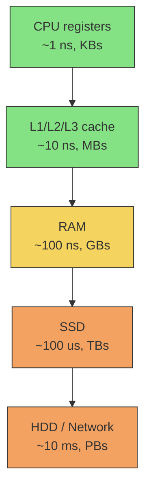
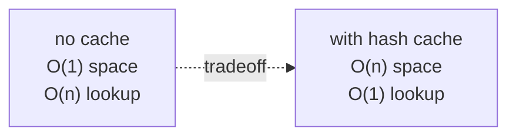

How does required memory change relative to `n`?

Counts:
- input itself (sometimes excluded)
- working memory (temporary structures)
- output

! Time-space tradeoff: caching values trades space for time. Hash table = O(n) space, O(1) lookup. Without it, O(1) space but O(n) lookup.

## Examples
- recursive call stack --> O(depth)
- memoisation table --> O(unique inputs)
- in place sort --> O(1) extra
- merge sort --> O(n) extra (the merge buffer)

## At scale
Big Data systems mostly care about space:
- can it fit in RAM? --> [[In-memory]] is 10x to 1000x faster
- can it fit on one disk? --> if not, [[HDFS]] or [[MPP]] partitioning
- can it fit in cache? --> [[Columnar Database]] compresses better

## Visual - memory hierarchy

Each step down = ~100x slower. Big Data architecture is largely about pushing the working set up this pyramid.

## Visual - time vs space tradeoff

## Learn more
- Wikipedia: [Space complexity](https://en.wikipedia.org/wiki/Space_complexity)
- [Latency Numbers Every Programmer Should Know](https://gist.github.com/jboner/2841832) - the classic table

