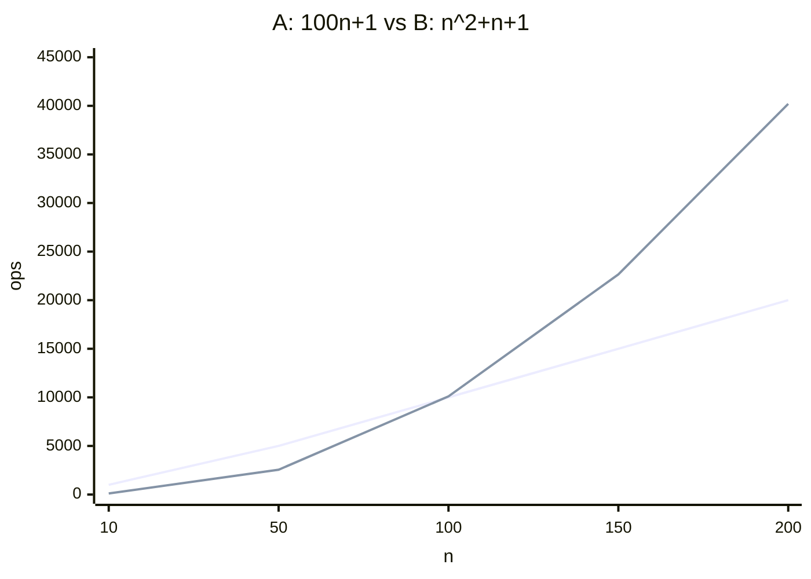
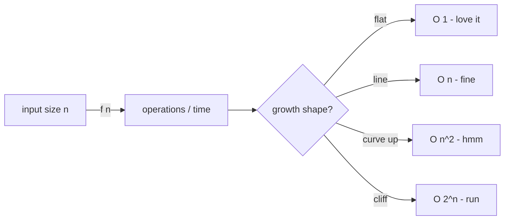

How does runtime change relative to input size `n`?

! Not "how fast on my laptop." That's micro benchmarks. Time complexity is about the SHAPE of the curve.

## Measuring in Python
```python
from timeit import default_timer as timer
start = timer()
# ... do work
end = timer()
print(end - start)
```

Jupyter:
```python
%%timeit
find_max(items)
# 4.1 µs ± 606 ns per loop ...
```

## Why shape matters more than constants
For `n` input size:
- A: `100n + 1`
- B: `n² + n + 1`

| n | A | B |
|---|---|---|
| 10 | 1 001 | 111 |
| 100 | 10 001 | 10 101 |
| 1 000 | 100 001 | 1 001 001 |
| 10 000 | 1 000 001 | > 10¹⁰ |

! Leading term dominates. B beats A for small n. A annihilates B at scale. Crossover is around n=100.

See [[Big O]] for the formal version, [[Complexity Classes]] for the menu.

## Visual - crossover


B wins for tiny n. A annihilates B once n > ~100.

## Visual - intuition



## Learn more
- [Big-O Cheat Sheet](https://www.bigocheatsheet.com/)
- [VisuAlgo](https://visualgo.net/) - watch algorithms run
- MIT 6.006 OCW: [Introduction to Algorithms](https://ocw.mit.edu/courses/6-006-introduction-to-algorithms-spring-2020/)

