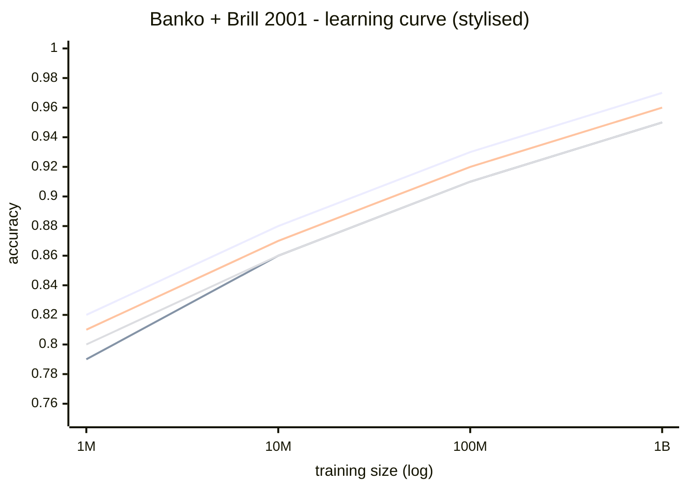

Banko + Brill, 2001. *Scaling to Very Very Large Corpora for Natural Language Disambiguation*. Microsoft Research.

## The setup
- **Task** - confusion set disambiguation. Pick right word from `{principle, principal}`, `{then, than}`, `{to, two, too}`, `{weather, whether}`.
- **Why this task** - labels are FREE. The correct answer is just visible in any edited text.
- **Corpus** - 1 billion words. Three orders of magnitude bigger than prior work. News, science, gov transcripts, lit.
- **Test set** - 1 million words of WSJ, disjoint.
- **Learners** - Winnow, Perceptron, Naïve Bayes, memory based.

## Findings

### 1. [[Learning Curves]] are log linear
Accuracy vs training size = straight line on log scale, all the way to 10⁹ words. No learner asymptotes.

! Translation: nobody knows where the ceiling is.

### 2. Representation grows log linearly
Model size also grows log linearly. So you get gains but you pay storage.

### 3. Voting helps when small, hurts when big
| Training size | Complementarity(L1, L2) |
|---|---|
| 10⁶ | 0.2612 |
| 10⁷ | 0.2410 |
| 10⁸ | 0.1759 |
| 10⁹ | 0.1612 |

Learners agree more as data grows. Ensembling adds nothing then hurts.

### 4. Active learning beats sequential sampling (when labels cost money)
- bag 10 Naïve Bayes classifiers
- score uncertainty by vote entropy
- pick M/2 most uncertain + M/2 random
- bigger unlabeled pool --> better accuracy for fixed budget

### 5. Weakly supervised plateaus then degrades
Auto label where all 10 classifiers agree. Accuracy improves up to a point, then declines as bias compounds.

## The course takeaway
> Spend effort on growing annotated collections, not comparing algorithms on tiny corpora.

See [[Unreasonable Effectiveness of Data]] for the philosophical version, [[Halevy Norvig Pereira]] for the Google-scale sequel.

## Visual

Straight lines, no asymptote.

## Learn more
- [Banko + Brill 2001 - paper PDF](https://aclanthology.org/P01-1005.pdf) (ACL Anthology)
- [[Halevy Norvig Pereira]] - the 2009 Google sequel that doubles down
- [[Learning Curves]] - what the chart actually shows

