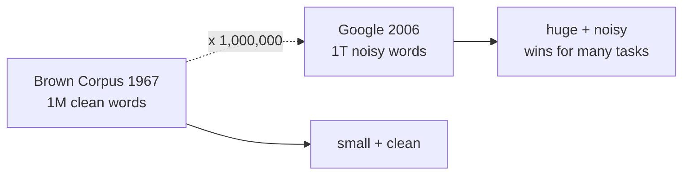
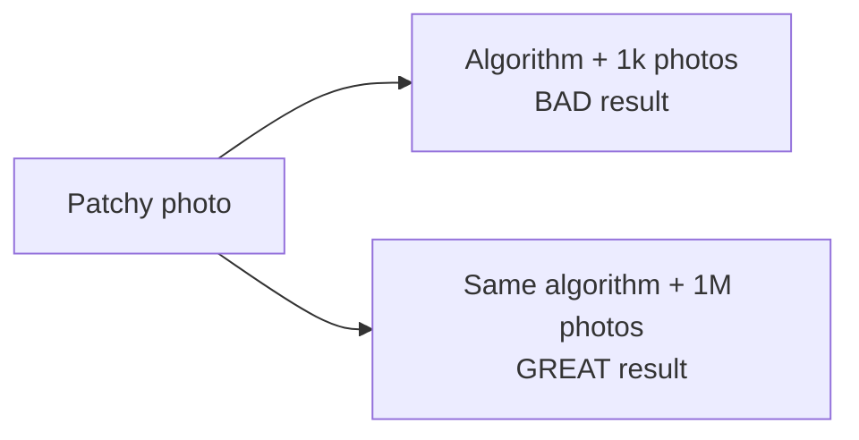
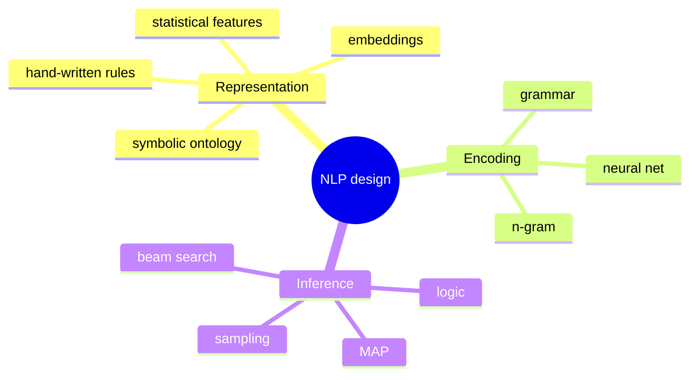

Halevy, Norvig, Pereira (Google). 2009. *The Unreasonable Effectiveness of Data*. IEEE Intelligent Systems.

## Thesis
For problems involving HUMAN BEHAVIOUR (language, vision), elegant theory fails. The antidote: web scale data.

> "Embrace complexity and make use of the best ally we have: the unreasonable effectiveness of data."

## Key arguments

### 1. Scale changes the game
- Brown Corpus 1967 = 1M English words.
- Google 2006 = 1 trillion word n grams (up to length 5).
- Noisy (typos, fragments, no annotation) but a MILLION times bigger.
- Size beats the noise for many tasks.

### 2. Use data that exists in the wild
- speech recognition + machine translation work because input/output pairs exist naturally (closed captioning, EU translations).
- POS tagging, NER, parsing need expert annotators --> expensive, slow, experts disagree.
- Lesson: use what the world already produces.

### 3. [[Memorization vs Generalization|Memorisation beats generalisation]] at scale
- statistical LMs = huge n-gram databases.
- modern MT = phrase tables. Rules only added when they beat memorisation.
- Hays + Efros photo scene completion: bad with thousands of photos, EXCELLENT with millions. Same algorithm.

### 4. Finite distinctions in practice
- English grammatical sentences = infinite in theory.
- ~1 billion examples is ≈ closed set for many human tasks.
- Humans only make a finite number of distinctions.

### 5. Don't throw away rare events
> "Throwing away rare events is almost always a bad idea."

Web data = individually rare + collectively frequent. See [[Long Tail]].

### 6. False dichotomy
People say NLP = either deep (hand grammar) or statistical (n grams). Reality has three orthogonal axes:
- representation
- encoding the model
- inference

### 7. Semantic Web vs semantic interpretation
- Semantic Web = software interop conventions.
- Semantic interpretation = making sense of ambiguous language.
- Humans disambiguate with shared cognitive/cultural context. Software has none.
- Project Halo cost $10,000 per textbook PAGE for a chemistry ontology. Doesn't scale.

### 8. Web tables as semantic raw material
- 150M web tables --> 2.5M distinct schemas.
- enables: synonym discovery, disambiguation by context, schema autocomplete.
- Paşca: 90% precision on top 10 class attributes.

## Closing advice
> "Choose a representation that can use unsupervised learning on unlabeled data... go out and gather some data, and see what it can do."

Direct line from this to [[NoSQL]], [[HDFS]], embedding stores, RAG. See [[Unreasonable Effectiveness of Data]].

## Learn more
- [Halevy, Norvig, Pereira 2009 - paper PDF](https://static.googleusercontent.com/media/research.google.com/en//pubs/archive/35179.pdf)
- Wigner 1960: [The Unreasonable Effectiveness of Mathematics in the Natural Sciences](https://www.maths.ed.ac.uk/~v1ranick/papers/wigner.pdf) - the title's origin
- Peter Norvig's site: [norvig.com](https://norvig.com/) - related essays on language and AI
- [[Banko and Brill]] - the empirical predecessor

## Visual - 1M vs 1T corpus

## Visual - photo scene completion

Hays + Efros 2007. Same code, different data scale, totally different output.

## Visual - the 3 axes (false dichotomy refuted)

"Deep" vs "statistical" is a false dichotomy. Three orthogonal axes.

