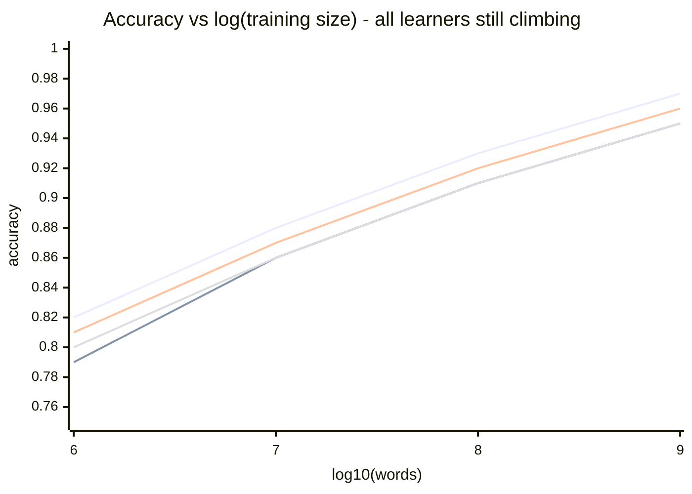
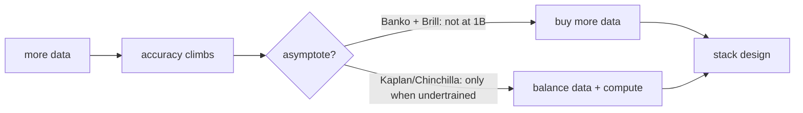

Accuracy as a function of training set size. The killer chart of [[Banko and Brill]].

## The shape
On log scale: STRAIGHT LINE. No knee, no asymptote. All four learners keep improving from 10⁶ to 10⁹ words.

```
accuracy ▲
         │              ╭──── still climbing
         │           ╭──╯
         │        ╭──╯     ╲
         │     ╭──╯         ╲ all 4 learners,
         │  ╭──╯              same slope-ish
         │──╯
         └─────────────────────►  log(n)
```

## Implications
1. **The ceiling is unknown.** Maybe 10¹⁰ asymptotes. Maybe 10¹². Nobody has the corpus.
2. **Algorithm choice matters less than data size.** Different learners converge to the same line.
3. **Investment shifts.** Spend on data acquisition + pipelines, not on a slightly cleverer model.

! This is the most architecturally consequential chart in the course. It justifies every Big Data tech below.

## Counterpoint
Modern deep learning + scaling laws (Kaplan, Hoffmann/Chinchilla) refined this: there ARE asymptotes when compute and data are balanced wrong. But the directional claim survives: more data ↑, accuracy ↑, mostly.

See [[Memorization vs Generalization]] for why this happens. See [[Long Tail]] for what fills in as n grows.

## Visual





## Learn more
- [Banko + Brill 2001 PDF](https://aclanthology.org/P01-1005.pdf)
- Kaplan 2020: [Scaling Laws for Neural Language Models](https://arxiv.org/abs/2001.08361)
- Chinchilla 2022: [Training Compute-Optimal LLMs](https://arxiv.org/abs/2203.15556)
- Sutton: [The Bitter Lesson](http://www.incompleteideas.net/IncIdeas/BitterLesson.html)

