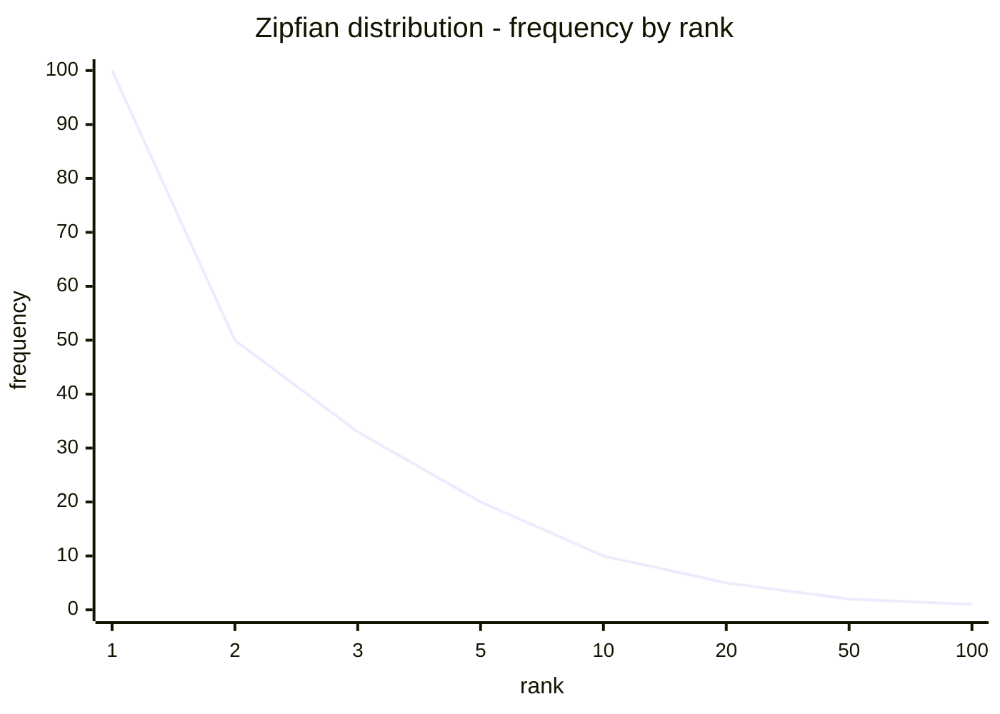
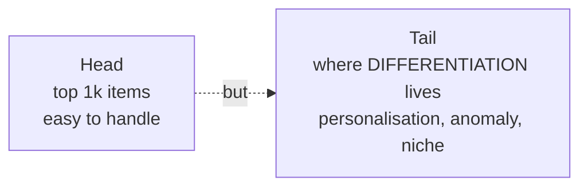

Most events are rare. Collectively they dominate.

```
freq ▲
     │█
     │█
     │█▄
     │██▄
     │███▄▄
     │██████▄▄▄▄▄▄▄▄▄▄▄_____________________________
     └─────────────────────────────────────────►  rank
                  ▲                ▲
              top 1k items      "long tail"
              easy to handle    where the volume lives
```

Zipfian distribution. Common in language, web search queries, news topics, customer demand.

## Why this matters architecturally
- if you only optimise for the head, you miss most of the value
- the long tail is where personalisation, anomaly detection, niche markets live
- [[Halevy Norvig Pereira]]: "throwing away rare events is almost always a bad idea"

## Consequence
- can't downsample the tail to make data "manageable" - that's where the differentiation lives
- need [[Storage and Compute]] architectures that scale linearly with cardinality
- favor [[NoSQL]] / [[HDFS]] over fixed schema warehouses for capturing arbitrary tail

! In team project context: news from Myanmar + Kazakhstan = literal long tail compared to USA + Germany. Capturing them is the WHOLE POINT.

See [[Memorization vs Generalization]] - memorisation captures the tail, generalisation flattens it.

## Visual


Top items dominate by rank. But sum of the tail = bulk of the mass.



## Learn more
- Chris Anderson, [The Long Tail (Wired 2004)](https://www.wired.com/2004/10/tail/) - the original essay
- Anderson book: *The Long Tail* - the longer version
- Wikipedia: [Zipf's law](https://en.wikipedia.org/wiki/Zipf%27s_law)

