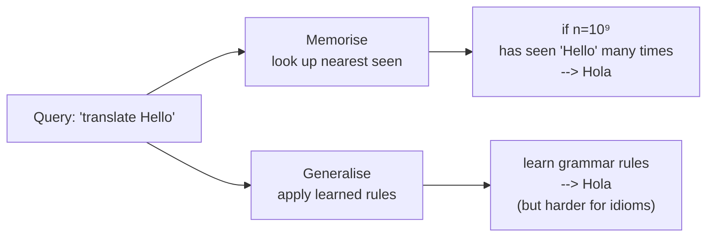
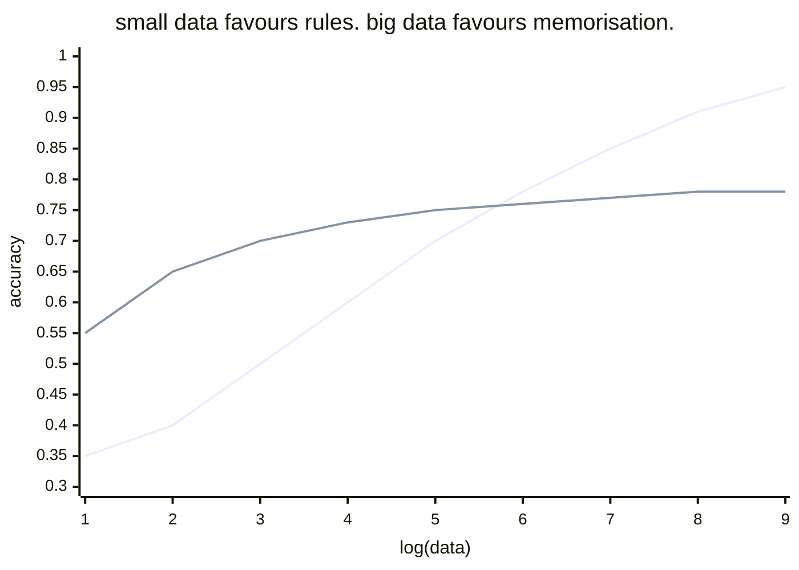

Classical ML: generalise from small data --> learn rules that work on unseen examples.

Web scale ML: memorise huge data --> look up the closest seen example.

[[Halevy Norvig Pereira]] argued: at scale, memorisation usually wins.

## Examples
- statistical machine translation = giant phrase tables. Add general rules only when they beat memorisation (dates, numbers).
- modern LLMs blur the line - they DO compress data into weights, but they also retain insane amounts of specific knowledge.
- RAG explicitly pushes memorisation OUT of the model and INTO a retrieval system.

## Why memorisation works at scale
- "all human distinctions are finite in practice"
- if you've seen 10⁹ examples, the next example probably resembles one you've seen
- generalisation only matters in the [[Long Tail]] gap where you HAVEN'T seen the example

## Architectural shape
Memorisation heavy stack:
- [[HDFS]] / object store for raw data
- vector DB / embedding store for "nearest seen" lookup
- [[NoSQL]] for structured lookup
- [[Streaming|stream processing]] for incremental ingestion

vs Generalisation heavy stack:
- small training dataset
- rich feature engineering
- one model artifact

! Big Data architectures lean memorisation. That's why they exist.

## Visual

Lines cross. Past the crossover, memorisation wins.

## Learn more
- [Halevy 2009 PDF](https://static.googleusercontent.com/media/research.google.com/en//pubs/archive/35179.pdf)
- Sutton, [The Bitter Lesson](http://www.incompleteideas.net/IncIdeas/BitterLesson.html) - "general methods that leverage computation win"
- [RAG explained](https://www.pinecone.io/learn/retrieval-augmented-generation/) - memorisation pushed out of the model

