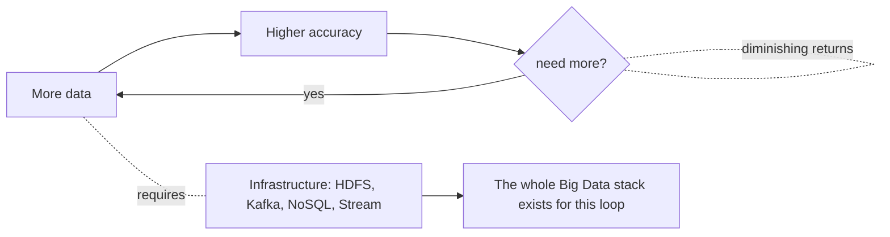
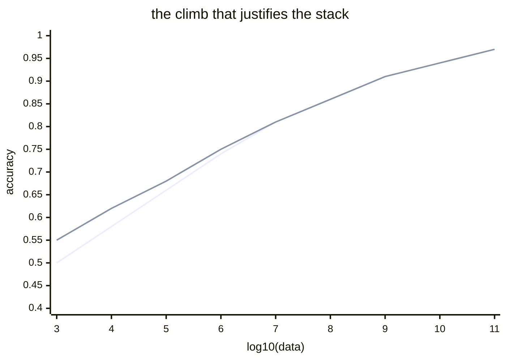

The thesis that holds the course together.

> "More data beats smarter algorithms. Up to a point."

Borrowed from Wigner's *Unreasonable Effectiveness of Mathematics in the Natural Sciences*. [[Halevy Norvig Pereira]] flipped it: for messy human problems (language, vision) elegant math fails, but huge data wins.

## Empirical backbone
- [[Banko and Brill]] (2001) - 1B words, no asymptote, all four learners keep climbing
- [[Halevy Norvig Pereira]] (2009) - Google trillion-word corpus, "use what exists in the wild"
- [[Watson 2014|Watson]] (2014) - the architecture tutorial that bakes the claim into the stack

## What it means architecturally
- if labels are free, scale the corpus
- pick [[NoSQL]] / [[HDFS]] over schema-strict warehouses for raw collection
- favor memorisation heavy approaches (n grams, retrieval, embedding lookup) - see [[Memorization vs Generalization]]
- don't throw away rare events - see [[Long Tail]]

! The "up to a point" matters. Bias, privacy, cost, ethics, and diminishing returns all push back. The course's later weeks (ethics, value) cover that.

## Diagram
```
accuracy ▲
         │                  ╭──── still climbing
         │               ╭──╯
         │            ╭──╯
         │         ╭──╯       ← Banko + Brill 2001
         │      ╭──╯
         │───╯
         └────────────────────►  log(training size)
                                 (1M → 1T words)
```

See also [[Learning Curves]].

## Learn more
- Wigner 1960: [The Unreasonable Effectiveness of Mathematics in the Natural Sciences](https://www.maths.ed.ac.uk/~v1ranick/papers/wigner.pdf) - source of the title meme
- [Banko + Brill 2001 PDF](https://aclanthology.org/P01-1005.pdf)
- [Halevy, Norvig, Pereira 2009 PDF](https://static.googleusercontent.com/media/research.google.com/en//pubs/archive/35179.pdf)
- Sutton 2019: [The Bitter Lesson](http://www.incompleteideas.net/IncIdeas/BitterLesson.html) - the deep-learning era version of the same argument. ESSENTIAL one-page read.
- Kaplan et al 2020: [Scaling Laws for Neural Language Models](https://arxiv.org/abs/2001.08361) - the modern refinement
- Hoffmann et al 2022 (Chinchilla): [Training Compute-Optimal LLMs](https://arxiv.org/abs/2203.15556)

## Visual




Algorithms differ on the left side. Converge on the right.


