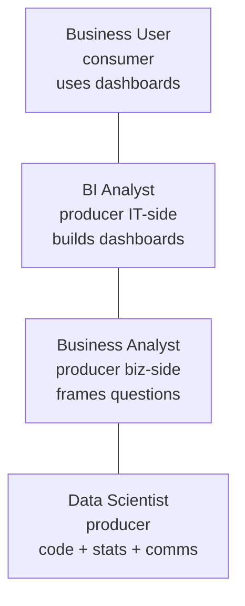
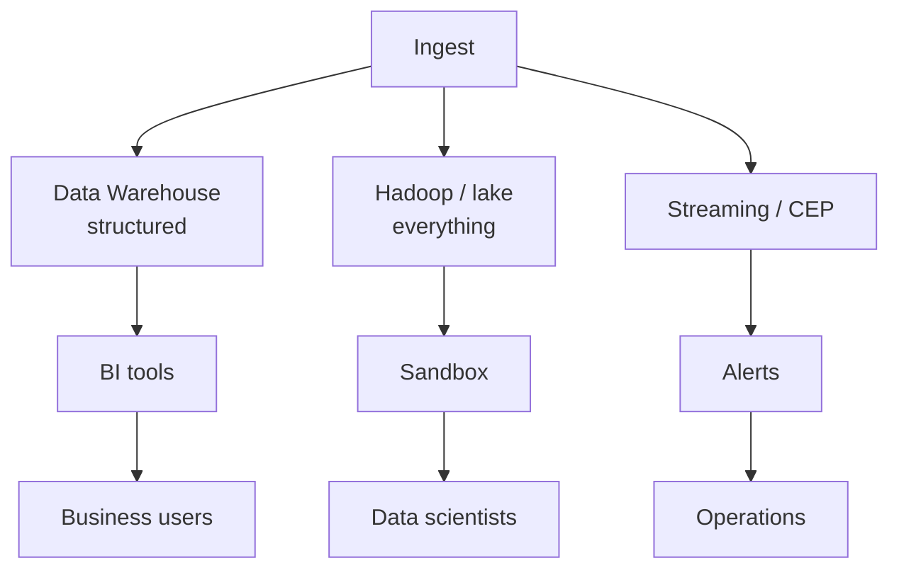

Hugh J. Watson, 2014. *Big Data Analytics: Concepts, Technologies, and Applications*. CAIS Vol 34, Article 65.

The course's architectural tour guide. Where most of the EA + Big Data vocab in this wiki comes from.

## Big themes
- Big Data = fourth gen of decision support. See [[Generations of Data Management]].
- Storing data = no value. Acting on it = value. See [[Value]].
- Three analytics types: [[Descriptive Analytics]] --> [[Predictive Analytics]] --> [[Prescriptive Analytics]].
- Big Data capability is FEDERATED. Warehouses + Hadoop + appliances + sandboxes + streaming + cloud + NoSQL all coexist.

## Cases worth remembering
- **Starbucks** - blog/Twitter monitoring, dropped price within hours.
- **Chevron** - 50TB seismic --> oil hit rate 1-in-5 to 1-in-3.
- **U.S. Xpress** - 900+ truck sensors, distinguishing idle types saved millions.
- **Target** - pregnancy prediction. PR backlash --> coupons mixed.

## Seven requirements for success
1. clear business need
2. strong committed sponsorship
3. business + analytics strategy aligned
4. fact based decision making culture
5. strong data infrastructure
6. right analytical tools
7. skilled people ([[Data Scientist|data scientists]])

## Platforms surveyed
- [[MPP]], [[In-memory]], SSDs, [[Columnar Database]], in-database analytics
- [[Data Warehouse]], [[Data Mart Appliance]], analytical sandboxes
- [[Stream Processing]], [[CEP]]
- [[Cloud]] (SaaS, PaaS, IaaS, RedShift, Zynga case)
- [[NoSQL]]
- [[Hadoop]] + ecosystem (Pig, HBase, Hive, Mahout)

## Privacy stinger
Three kinds of invasion (Clemons et al 2014):
1. uninvited intrusion (spam) - most salient, least harmful
2. fraud / identity theft - most serious
3. personal profiling for commercial advantage - low awareness, sharp concern when explained

See [[Privacy]].

## Visual - the Big Data org

## Visual - federated stack

Warehouse + Hadoop + streaming co-exist. SQL / Hive = the glue.

## Learn more
- [Watson 2014 paper (CAIS)](https://aisel.aisnet.org/cais/vol34/iss1/65/)
- Davenport + Patil 2012: [Data Scientist: The Sexiest Job](https://hbr.org/2012/10/data-scientist-the-sexiest-job-of-the-21st-century)

