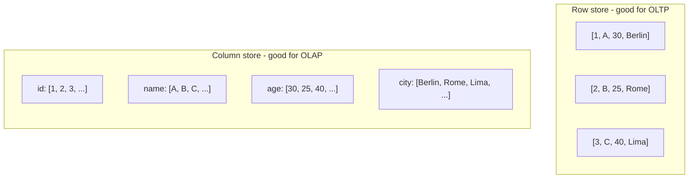
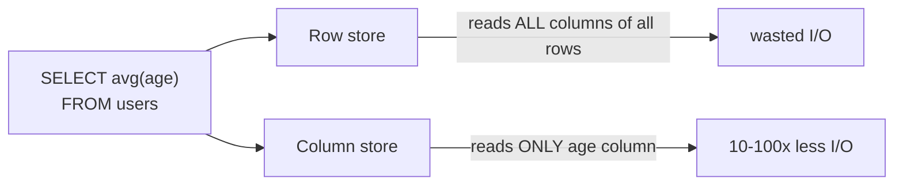

Flip row-vs-column orientation. Store all values of one column contiguously instead of all values of one row.

```
Row store (OLTP):
row 1: [id=1, name="A", age=30, city="Berlin"]
row 2: [id=2, name="B", age=25, city="Rome"]
row 3: [id=3, name="C", age=40, city="Lima"]

Column store (OLAP):
id:    [1, 2, 3, ...]
name:  ["A", "B", "C", ...]
age:   [30, 25, 40, ...]
city:  ["Berlin", "Rome", "Lima", ...]
```

## Why
- analytical queries hit FEW COLUMNS across MANY ROWS. eg `SELECT avg(age) FROM users`.
- row store reads full rows --> wastes I/O.
- column store reads only `age` --> 4x to 100x less I/O.
- columns of same type compress WAY better (run length, dictionary, delta).

## When NOT to use
- OLTP. Inserting a single row touches every column file. Expensive.
- if you usually `SELECT *`. No win.

## Examples
- Sybase IQ (pioneer, mid 90s)
- Vertica, ParAccel, Teradata Columnar
- Amazon Redshift, Snowflake, BigQuery, ClickHouse, DuckDB
- file formats: Parquet, ORC, Arrow

! Modern Big Data analytics = columnar everywhere. Combine with [[MPP]] (scale out) + [[In-memory]] (scale up) for the full stack.

## Visual



## Visual - query I/O cost



## Learn more
- Abadi 2008: [Column-Stores vs Row-Stores: How Different Are They Really?](https://web.stanford.edu/class/cs245/win2014/papers/abadi-column-stores.pdf) - the comparison paper
- [DuckDB - columnar in your laptop](https://duckdb.org/why_duckdb) - try it
- [ClickHouse architecture](https://clickhouse.com/docs/en/development/architecture)
- [Apache Parquet](https://parquet.apache.org/) - the file format
- [Apache Arrow](https://arrow.apache.org/) - the in-memory format

