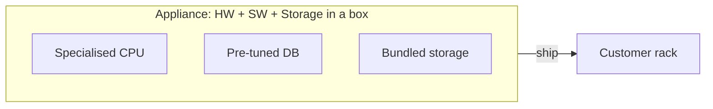
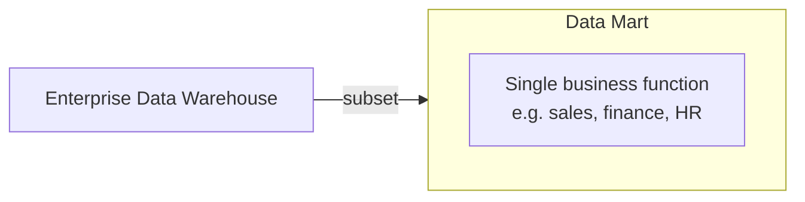

Integrated hardware + software + storage shipped as one box. "Appliance" term coined by Netezza (now IBM PureData).

## Why an appliance
- buy a server, get the warehouse pre-tuned
- skip months of config + tuning
- vendor optimises hw + sw together (proprietary advantage)

## Examples
- IBM PureData (was Netezza)
- Oracle Exadata
- Teradata IntelliFlex
- SAP HANA appliances

## Uses
- standalone warehouse
- offload from main [[Data Warehouse]]
- analytical sandbox for power users

## Modern shift
Cloud killed most of the appliance market. Snowflake / Redshift / BigQuery = "appliance as a service." No box to ship.

! Appliance era was 2005-2015 mostly. Course material reflects that. Today's analog: serverless data warehouse SKUs.

## Visual

## Learn more
- [IBM PureData (was Netezza)](https://www.ibm.com/products/db2-warehouse)
- [Oracle Exadata](https://www.oracle.com/engineered-systems/exadata/)
- Comparison: [Data warehouse vs data mart](https://www.ibm.com/cloud/learn/data-warehouse)

