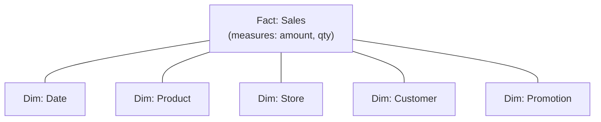
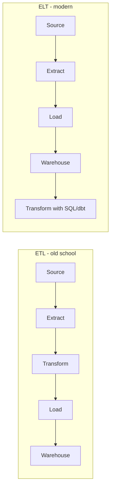

The workhorse of [[Descriptive Analytics]]. "Squeaky clean" integrated structured data.

## Properties
- integrated from many sources (CRM, ERP, web logs, etc)
- conformed dimensions ("customer" means the same thing everywhere)
- historised (slowly changing dimensions track change over time)
- optimised for read-heavy analytical queries
- usually [[Columnar Database]] + [[MPP]] under the hood

## ETL vs ELT
- **ETL** - Extract, Transform, Load. Old school. Transform before warehouse.
- **ELT** - Extract, Load, Transform. Modern. Land raw in warehouse, transform with SQL (dbt).

## Vendors
- IBM (Db2), Oracle, SAP, Microsoft (Synapse), Teradata
- Cloud native: Snowflake, BigQuery, Redshift, Databricks SQL

## Relationship to [[Hadoop]] + lake
- warehouse = clean, governed, queryable
- lake = raw, cheap, any shape
- modern "lakehouse" = lake storage + warehouse query layer (Delta, Iceberg)

! Warehouse doesn't go away in Big Data era. Watson: warehouse + Hadoop co-exist. SQL / HiveQL is the lingua franca.

See [[Generations of Data Management]] for the historical arc.

## Visual - star schema

One fact in the middle (transactions), dimensions around it. Star shape.

## Visual - ETL vs ELT

Cloud warehouses + cheap compute = land raw, transform inside.

## Learn more
- Kimball + Ross, *The Data Warehouse Toolkit* - canonical reference
- [dbt docs](https://docs.getdbt.com/) - the modern ELT tool
- [Snowflake architecture](https://docs.snowflake.com/en/user-guide/intro-key-concepts)
- [BigQuery under the hood](https://cloud.google.com/blog/products/bigquery/bigquery-under-the-hood)

