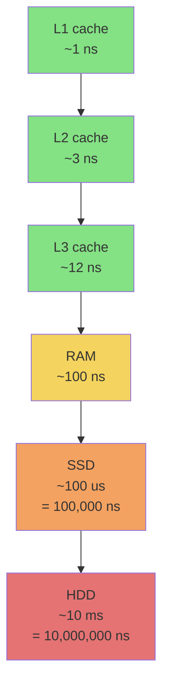
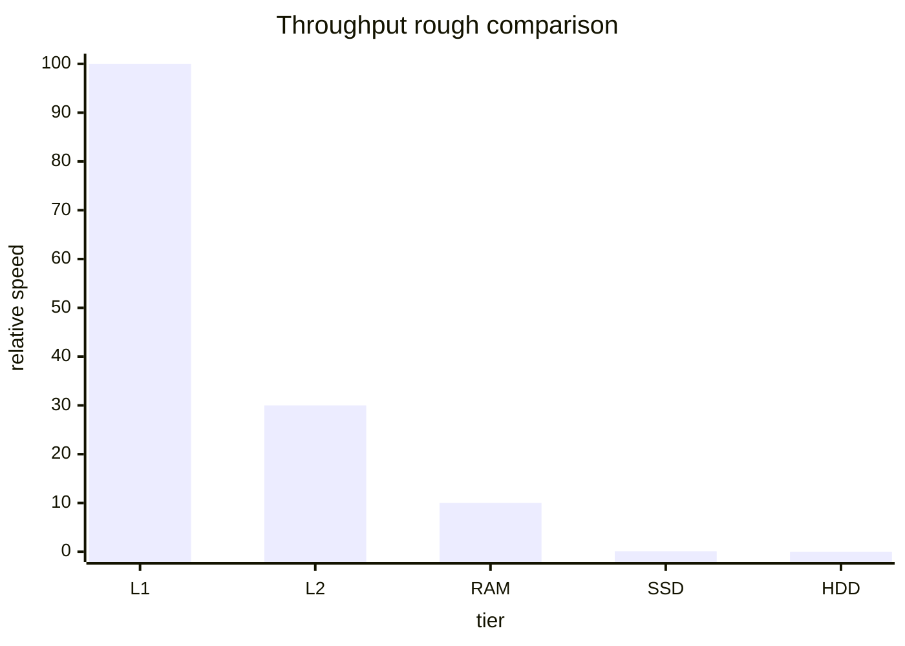

Keep working set in RAM instead of disk.

! 10x to 1,000x faster than disk depending on workload.

## Why
- disk seeks = 5-10ms. RAM access = 100ns. ~10⁵ difference.
- analytical queries touch many rows, few columns - RAM keeps the column hot.
- transactional workloads also benefit if dataset fits.

## Examples
- **SAP HANA** - in memory + [[Columnar Database]] platform.
- **QlikView** - in memory BI on the desktop. Smaller scale but same principle.
- **Redis, Memcached** - cache layer for OLTP.
- **Spark** - keeps RDDs in memory across stages (vs MapReduce that hits disk between).

## Cost catch
RAM is 100x more expensive per GB than disk. So:
- only the hot working set lives in RAM
- cold data stays on disk / object store
- compression matters (columnar wins again)

! [[Columnar Database]] + [[In-memory]] is the modern OLAP stack. See [[MPP]] for how it scales sideways.

## Visual - the speed ladder

Each step down = 10x to 100x slower.

## Learn more
- [Latency Numbers Every Programmer Should Know](https://gist.github.com/jboner/2841832)
- [SAP HANA overview](https://www.sap.com/products/technology-platform/hana.html)
- [Apache Spark - RDDs in memory](https://spark.apache.org/docs/latest/rdd-programming-guide.html)

