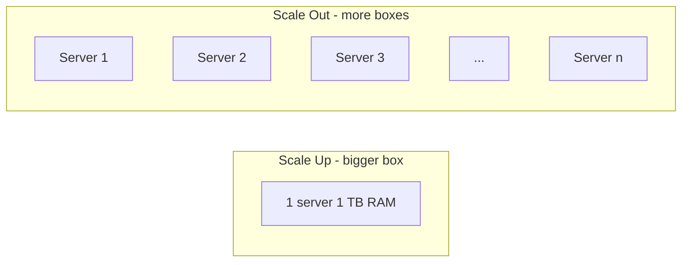

Massively Parallel Processing. Foundation of every modern Big Data platform.

```
       client query
            │
            ▼
       ┌─────────┐
       │ leader  │
       └────┬────┘
            │ partition + dispatch
   ┌────────┼────────┬────────┬────────┐
   ▼        ▼        ▼        ▼        ▼
[node 1] [node 2] [node 3] [node 4] [node 5]
 data part data part data part data part data part
   │        │        │        │        │
   └────────┴────────┴────────┴────────┘
                shuffle / aggregate
                     │
                     ▼
                  result
```

## Idea
- hundreds to thousands of commodity servers
- shared nothing (each node has its own disk + RAM)
- data partitioned across nodes
- queries parallelised across nodes
- results shuffled + aggregated

## Why it works
- commodity hw is cheap, so node count = budget knob
- failures are EXPECTED, software handles them (replication, retry)
- linear-ish scaling for many workloads

## Examples
- Teradata (the OG, pre-commodity)
- Greenplum, Vertica
- Amazon Redshift, Snowflake, BigQuery
- Hadoop + MapReduce, Spark - same shape, different glue

! [[Columnar Database]] + MPP = most analytics warehouses today.

vs [[In-memory]] - MPP scales out (more boxes), in-memory scales up (bigger box).

## Visual - scale up vs scale out



## Learn more
- DeWitt + Gray 1992: [Parallel Database Systems: The Future of High Performance Database Systems](https://www.cs.cmu.edu/~natassa/courses/15-823/F02/papers/parallel-dewitt-92.pdf)
- [Snowflake architecture overview](https://docs.snowflake.com/en/user-guide/intro-key-concepts) - modern MPP example
- [BigQuery under the hood](https://cloud.google.com/blog/products/bigquery/bigquery-under-the-hood)

