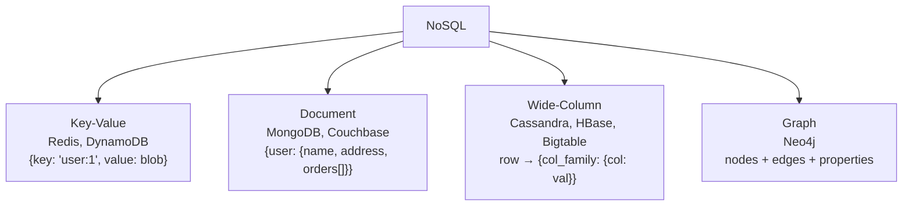
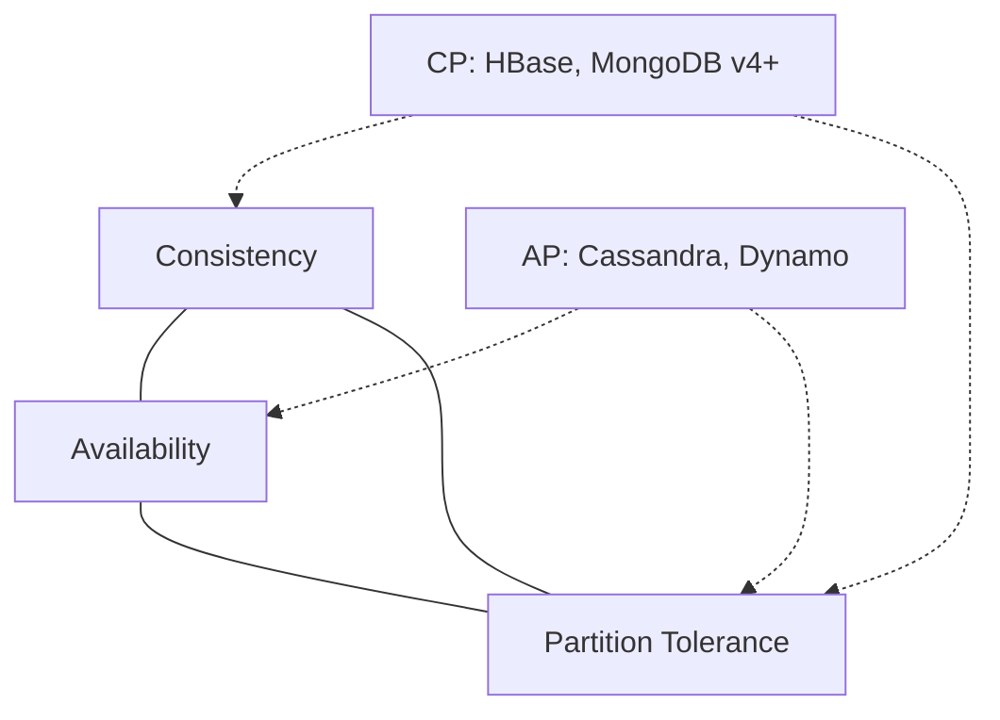

"Not Only SQL." Family of non relational stores. Schemaless, scale out, eventually consistent.

## Why it exists
- web scale companies (Google, Amazon, Facebook) hit RDBMS limits
- needed: petabyte scale, commodity hw, any data shape, geographic distribution
- consistency willing to be sacrificed for availability + partition tolerance (CAP theorem)

## Four families

| Family | Shape | Example |
|--------|-------|---------|
| Key value | hash map | Redis, DynamoDB, Riak |
| Document | JSON tree | MongoDB, Couchbase |
| Wide column | sparse columnar map | Cassandra, [[HBase]], Bigtable |
| Graph | nodes + edges | Neo4j, JanusGraph |

## Tradeoffs vs RDBMS
- (+) schema flexibility, horizontal scale, write throughput
- (-) weaker security, weaker tooling, eventual consistency surprises
- (-) joins are expensive or impossible
- (-) you usually have to denormalise --> data dup

## When to use
- [[Variety]] high - any shape input
- [[Velocity]] high - write heavy ingestion
- [[Volume]] high - need to shard
- ad hoc analysis NOT required (use [[Data Warehouse]] for that)

! Most real Big Data stacks use BOTH: NoSQL for raw ingestion, warehouse / lake for analytics. Watson calls this federated.

## Visual - four families

## Visual - CAP triangle

Pick 2 of 3 under network partition. RDBMS = CP. Most NoSQL = AP.

## Learn more
- Gilbert + Lynch 2002: [Brewer's Conjecture proof](https://groups.csail.mit.edu/tds/papers/Gilbert/Brewer2.pdf) - formal CAP
- Chang et al 2006: [Bigtable paper](https://research.google/pubs/bigtable-a-distributed-storage-system-for-structured-data/) - wide-column origin
- DeCandia et al 2007: [Dynamo paper](https://www.allthingsdistributed.com/files/amazon-dynamo-sosp2007.pdf) - eventual consistency origin
- Kleppmann, *Designing Data-Intensive Applications* (DDIA) - THE book for this material
- [NoSQL database comparison](https://db-engines.com/en/ranking) - DB-Engines ranking

