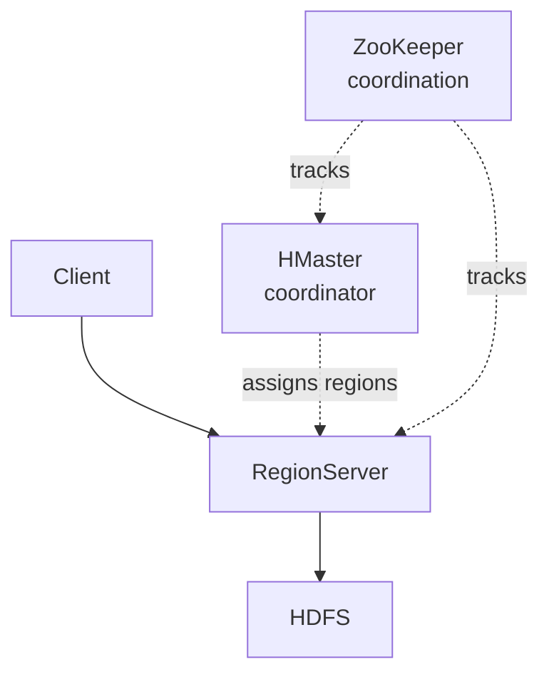

Distributed columnar [[NoSQL]] store on top of [[HDFS]]. Inspired by Google Bigtable (Chang et al, 2006).

## Shape
- wide column store
- key value at the row level, but each value is a map of (column family, column, timestamp) --> value
- sparse - missing columns cost nothing
- fast random reads + writes (unlike HDFS which is append only)

## When to use
- huge tables (billions of rows)
- need random access (not just scan)
- variable schema across rows
- write throughput matters

## Examples
- Facebook Messages was on HBase (originally)
- time series workloads
- user profile stores

## Limits
- no SQL natively (use Phoenix layer or Hive integration)
- no joins
- consistency model is per row, not multi row

Compare to other [[NoSQL]] families. Cassandra is the AP-side cousin, HBase is the CP side (built on HDFS).

## Visual - sparse wide-column

```
row key →   column family 'info'                    column family 'visits'
            ─────────────────────────────────       ──────────────────────────
'user:42'   name=Alice  email=a@x.com  age=30       2024-01:5  2024-02:12
'user:43'   name=Bob                   age=25       2024-01:2
'user:44'   name=Carol                                         2024-02:30
                       ↑
                       missing columns cost ZERO bytes
```

## Visual - layered on HDFS



## Learn more
- [Apache HBase](https://hbase.apache.org/)
- Chang et al 2006: [Bigtable paper](https://research.google/pubs/bigtable-a-distributed-storage-system-for-structured-data/) - HBase's ancestor
- [HBase vs Cassandra](https://www.scylladb.com/glossary/hbase-vs-cassandra/) - the famous comparison

