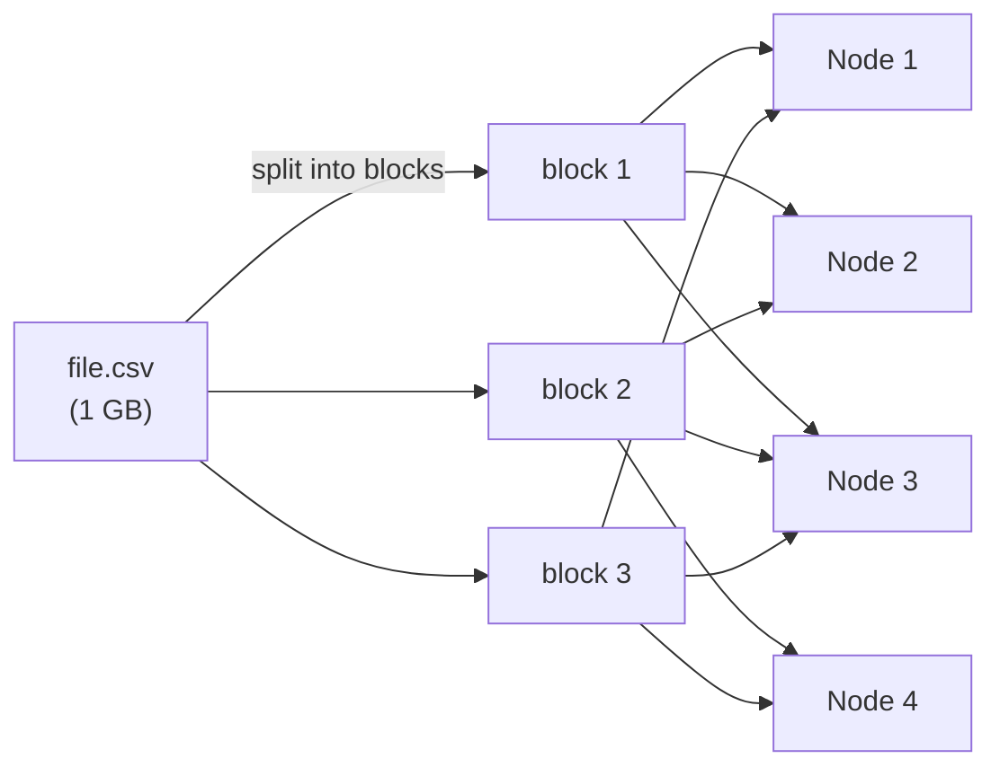
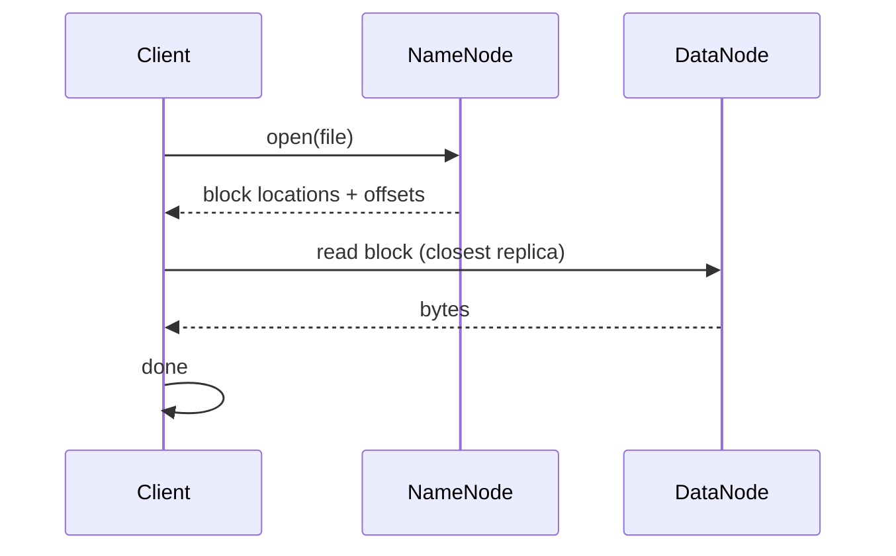

Distributed file system at the heart of [[Hadoop]]. Modeled on Google's GFS (2003).

```
NameNode (metadata: which block lives where)
   │
   ├── DataNode 1 ── block A1, block B2, block C3
   ├── DataNode 2 ── block A2, block B1, block C2
   ├── DataNode 3 ── block A3, block B3, block C1
   └── ...

each block replicated 3x for fault tolerance
```

## Properties
- no data model. Stores any file. Schema applied later at read time.
- block size big (128 MB or 256 MB) - optimised for sequential read
- replication = default 3 copies on 3 nodes
- write once, read many. Bad at random writes, good at append + scan.

## Weak spot
**NameNode** = single point of failure (older versions). Modern Hadoop has HA NameNode + JournalNodes.

## Why it mattered
- pre HDFS: storing PBs meant SAN / NAS, expensive proprietary boxes
- post HDFS: storing PBs meant rack of commodity servers, $/GB plummeted
- enabled everything downstream: [[MapReduce]], [[HBase]], [[Hive]], cheap experiments

## Modern equivalents
- cloud object storage: S3, GCS, Azure Blob
- in many lakehouses HDFS is replaced by S3 + a metastore (Glue, Iceberg, Delta)

! S3 took over because operating HDFS is painful. Same architectural pattern, different ops cost.

## Visual - replication


Each block lives on 3 nodes. Lose one node, still 2 copies.

## Visual - read flow



## Learn more
- [HDFS Architecture Guide](https://hadoop.apache.org/docs/current/hadoop-project-dist/hadoop-hdfs/HdfsDesign.html) - official
- Ghemawat 2003: [The Google File System](https://research.google/pubs/the-google-file-system/) - GFS, the original
- [AWS S3 vs HDFS comparison](https://aws.amazon.com/blogs/big-data/migrating-apache-hadoop-data-from-on-premises-to-amazon-s3/) - why object stores took over

