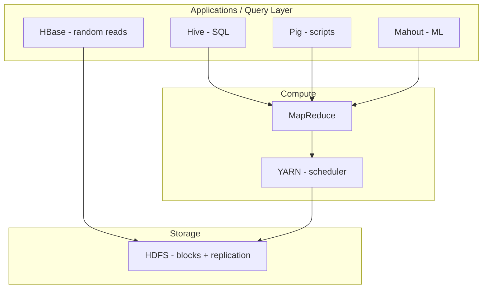
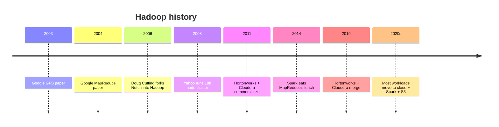

Open source framework for distributed storage + processing. Doug Cutting + Mike Cafarella, named after Cutting's son's stuffed elephant.

```
   ┌──────────────┐
   │   Hadoop     │
   ├──────────────┤
   │  MapReduce   │  ◄── compute
   │  YARN        │  ◄── scheduler
   │  HDFS        │  ◄── storage
   └──────────────┘
```

## Origin
- Cutting + Cafarella working on **Nutch** (open source web search).
- Google publishes [GFS](https://research.google/pubs/the-google-file-system/) (2003) and [MapReduce](https://research.google/pubs/mapreduce-simplified-data-processing-on-large-clusters/) (2004).
- Cutting reimplements both as Hadoop, joins Yahoo.
- Yahoo ran 42,000 servers on Hadoop at peak.

## Components
- [[HDFS]] - distributed file system, no data model, stores any file
- [[MapReduce]] - parallel batch compute
- YARN - resource scheduler (split from MapReduce in Hadoop 2)
- ecosystem: [[Hive]] (SQL), [[HBase]] (columnar store), [[Pig]] (scripting), Mahout (ML)

## Three use patterns (Watson)
1. **Online archive** - cheap, expandable cold storage
2. **Source system feeding a warehouse** - raw ingest, transform, push clean rows to DWH
3. **Analytics engine itself** - run jobs directly on HDFS

## Weaknesses
- batch only, no real time
- [[MapReduce|MR]] has lots of disk I/O between stages (Spark fixes this)
- NameNode single point of failure (older versions)
- operationally heavy

## Distros
Cloudera, Hortonworks (merged), MapR (rip). They wrapped Apache parts with integration + support.

! Modern Big Data has mostly moved past Hadoop to cloud object storage + Spark + Flink. But the ARCHITECTURE patterns Hadoop established are everywhere.

## Visual - the ecosystem



## Visual - timeline



## Learn more
- [Apache Hadoop](https://hadoop.apache.org/) - official site
- Dean + Ghemawat 2004: [MapReduce paper](https://research.google/pubs/mapreduce-simplified-data-processing-on-large-clusters/)
- Ghemawat 2003: [The Google File System](https://research.google/pubs/the-google-file-system/)
- White, *Hadoop: The Definitive Guide* - the bible
- YouTube channel: [Apache Hadoop Tutorial - Simplilearn](https://www.youtube.com/results?search_query=hadoop+architecture+tutorial)

