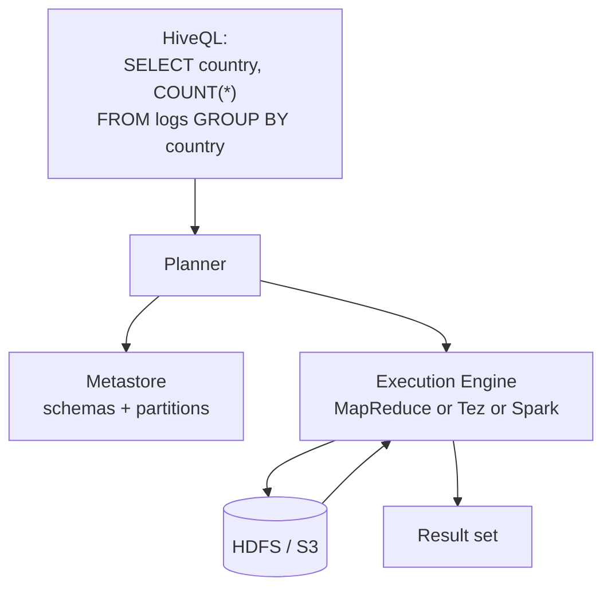
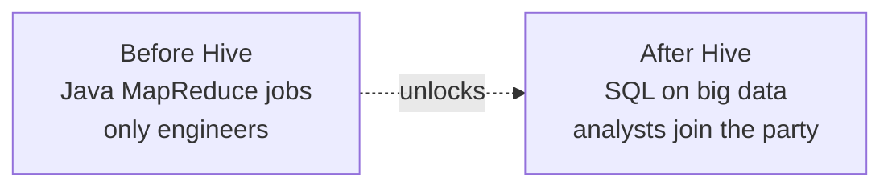

SQL on [[Hadoop]]. Translates HiveQL queries into [[MapReduce]] jobs (later Tez, Spark).

## Why it mattered
- analysts speak SQL, not Java [[MapReduce]] code
- Hive unlocked Hadoop for the BI crowd
- "single language across warehouse + Hadoop" - the integration glue Watson highlights

## Architecture
```
HiveQL query
   │
   ▼
metastore (table schemas, partitions)
   │
   ▼
query planner --> physical plan
   │
   ▼
execution engine (MR / Tez / Spark)
   │
   ▼
HDFS / S3
```

## Weak spots
- latency. Even a SELECT COUNT(*) is seconds to minutes.
- not for interactive ad hoc analytics (use Presto / Trino / Impala instead).
- evolved schema management is painful.

## Modern echo
- the Hive metastore lives on - Spark, Presto, Trino, Iceberg all integrate with it
- "Hive tables" = a de facto data lake table convention

See [[Hadoop]] for the bigger ecosystem.

## Visual



## Visual - what Hive did to the org



## Learn more
- [Apache Hive](https://hive.apache.org/) - official
- [Hive vs Presto vs Spark SQL](https://www.databricks.com/blog/2017/07/12/benchmarking-big-data-sql-platforms-in-the-cloud.html) - comparison
- [Trino (forked from Presto)](https://trino.io/) - the modern interactive replacement

