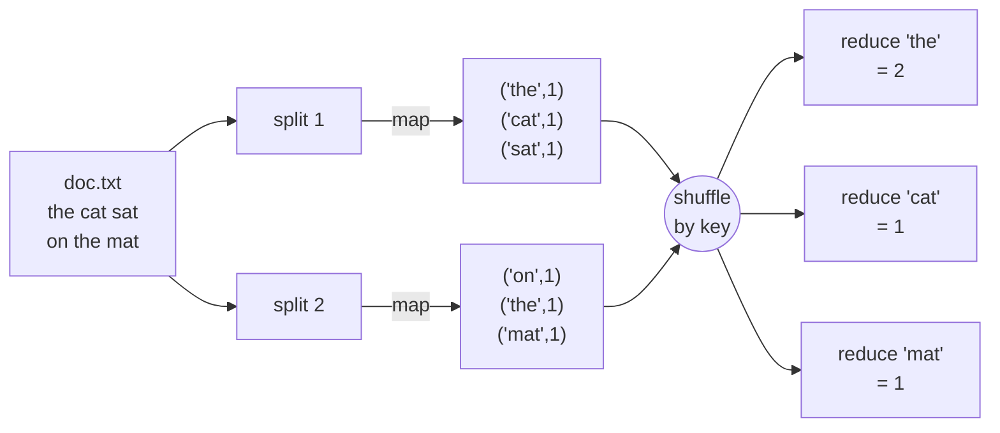
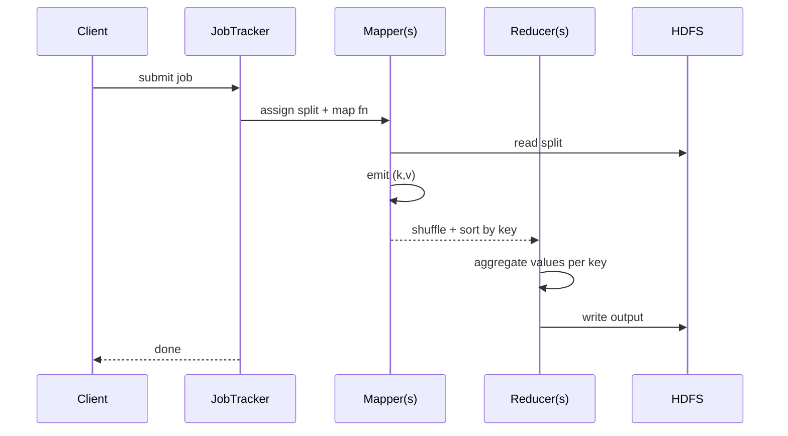

Distributed batch compute pattern. Map out, process, bring together, reduce.

! When you bring together you need to do sum, which is always O(n).

```
[input file]
     │ split
     ▼
┌────┬────┬────┬────┐
│ S1 │ S2 │ S3 │ S4 │
└──┬─┴──┬─┴──┬─┴──┬─┘
   │    │    │    │
   ▼    ▼    ▼    ▼
 map  map  map  map      ◄── parallel, per split
   │    │    │    │
   └────┴─┬──┴────┘
          ▼ shuffle + sort (by key)
   ┌──────┬──────┐
   │  R1  │  R2  │       ◄── reducers per key group
   └──┬───┴──┬───┘
      ▼      ▼
   [output partitions]
```

## Origin
Dean + Ghemawat, Google, 2004. *Simplified Data Processing on Large Clusters*. See [[Hadoop]] for how it spread.

## Programming model
1. **Map** - take input, emit (key, value) pairs.
2. **Shuffle + sort** - framework groups by key.
3. **Reduce** - take (key, list of values), emit (key, aggregated value).

Word count canonical example:
```
map("doc.txt") -> [("the", 1), ("cat", 1), ("the", 1), ...]
shuffle       -> [("the", [1, 1]), ("cat", [1])]
reduce        -> [("the", 2), ("cat", 1)]
```

## Why it worked
- programmer writes only map + reduce
- framework handles: parallelism, fault tolerance, data locality, scheduling, shuffle
- runs on commodity hardware

## Why it died
- batch only, hours per job
- lots of disk I/O between stages
- awkward for iterative algorithms (ML, graph)

## Successors
- **Spark** - same shape, in memory, supports iteration, lazy DAG
- **Flink** - stream native, true low latency
- **Beam** - portable model on top of multiple runners

Related: [[HDFS]], [[Hive]], [[Pig]], [[HBase]].

## Visual - word count flow



## Visual - timing



## Learn more
- Dean + Ghemawat 2004: [MapReduce paper](https://research.google/pubs/mapreduce-simplified-data-processing-on-large-clusters/)
- Visualisation: [MapReduce step-by-step on developer.ibm.com](https://www.ibm.com/topics/mapreduce)
- Successor papers: Zaharia 2012 ([RDDs/Spark](https://www.usenix.org/conference/nsdi12/technical-sessions/presentation/zaharia))

