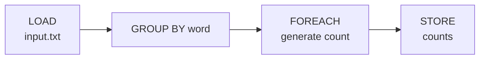
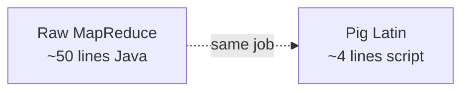

High level scripting language on top of [[MapReduce]]. Yahoo, ~2008.

## Why
- writing raw MapReduce in Java = verbose
- analysts want a data flow language, not a programming language
- Pig Latin = chainable transforms (LOAD, FILTER, JOIN, GROUP, STORE)

## Example
```pig
A = LOAD 'input.txt' AS (word:chararray);
B = GROUP A BY word;
C = FOREACH B GENERATE group, COUNT(A);
STORE C INTO 'counts';
```

That's the word count from [[MapReduce]] in 4 lines.

## Status
- mostly dead now. Spark + Flink + dbt eat its lunch.
- still on some Hadoop deployments as legacy
- worth knowing because the ETL dataflow style it pioneered is everywhere (dbt, Airflow, Beam)

## Visual - dataflow



## Visual - vs raw MapReduce



## Learn more
- [Apache Pig](https://pig.apache.org/) - official (legacy)
- Olston et al 2008: [Pig Latin paper](http://infolab.stanford.edu/~olston/publications/sigmod08.pdf) - the original

