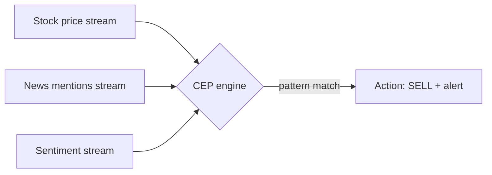
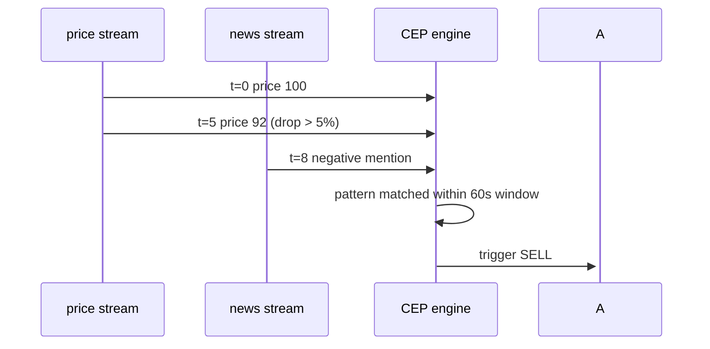

Many streams in, pattern matching across them, action out.

## vs plain [[Stream Processing]]
- **Stream processing** = one source, transform each event
- **CEP** = many sources, look for combinations / sequences / temporal patterns

## Example
```
stream A: stock price
stream B: news mentions
stream C: trader sentiment

CEP rule:
  IF price drops >5% in 60s
  AND negative news mention in last 5min
  AND sentiment turned negative in last 30min
  THEN trigger sell + alert
```

## Engines mentioned by Watson
- Tibco StreamBase
- Tibco BusinessEvents

Modern: Flink CEP library, Esper, Drools Fusion. Most "event driven architecture" toolchains have a CEP flavour now.

## Patterns it expresses
- temporal sequence (A then B within 60s)
- absence (A but no B in 5min)
- aggregation (sum over sliding window)
- correlation (event in stream X matches event in stream Y by key)

! CEP is conceptually a query language with TIME baked in. Streams are tables that NEVER STOP. CEP queries reason about that.

## Visual - many streams, one decision



## Visual - temporal pattern



## Learn more
- [Esper CEP docs](https://www.espertech.com/esper/) - the OSS reference
- [Flink CEP library](https://nightlies.apache.org/flink/flink-docs-master/docs/libs/cep/) - modern CEP on Flink
- Akidau et al 2015: [The Dataflow Model](https://www.vldb.org/pvldb/vol8/p1792-Akidau.pdf) - event-time framing

