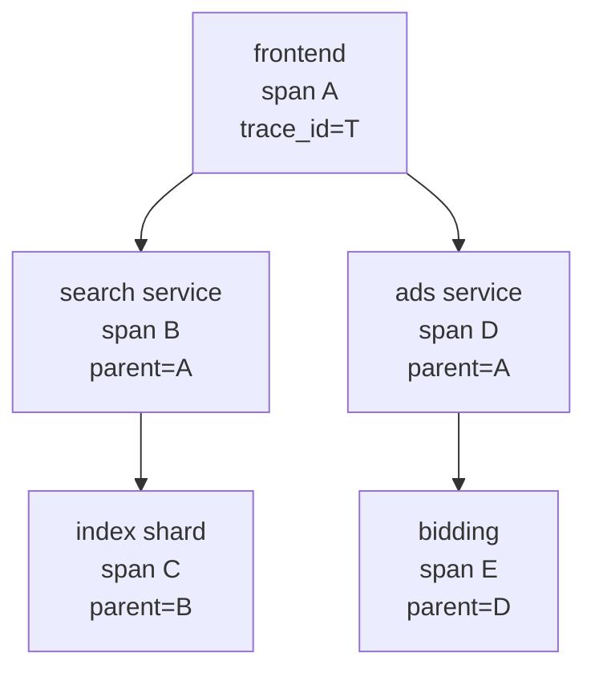
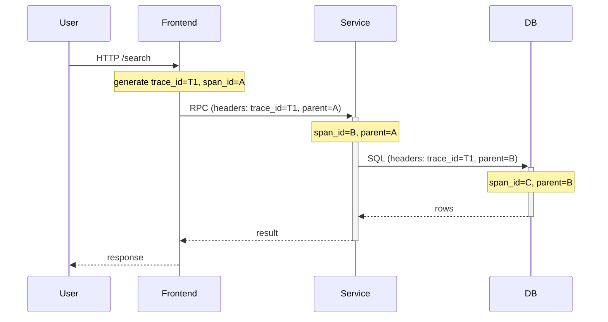

Sigelman et al, Google, 2010. *Dapper, a Large Scale Distributed Systems Tracing Infrastructure*.

The paper [[OpenTelemetry]] descends from.

## The problem
At Google scale, a single user request fans out across HUNDREDS of services. When latency spikes, where did the time go? You can't read every log.

## The solution
- **Span** - one unit of work (a function call, RPC, DB query). Has start, end, attributes.
- **Trace** - tree of spans for one logical request. Identified by trace_id propagated across services.
- **Context propagation** - trace_id + parent_span_id flow through every RPC header.
- **Sampling** - record 1 in N traces. Production traffic is too big to record all.

```
client request
    └─ frontend (span_id: A, trace_id: T)
         ├─ search service (span_id: B, parent: A)
         │     └─ index shard (span_id: C, parent: B)
         └─ ads service (span_id: D, parent: A)
```

## Design principles that survived into OTel
1. **Low overhead** - if it's expensive, devs disable it
2. **Application level transparency** - instrument frameworks, not user code
3. **Ubiquity** - one trace must span every service to be useful

## Sampling tradeoff
- head sampling (decide at trace start, cheap, loses rare interesting traces)
- tail sampling (decide at trace end, expensive, captures anomalies)
- OTel collector supports both via processors

! Reading Dapper before designing an OTel collector topology saves you a LOT of false starts.

Paper: https://research.google/pubs/dapper-a-large-scale-distributed-systems-tracing-infrastructure/

## Visual - trace tree



## Visual - context propagation


trace_id propagates everywhere. parent_span_id rebuilds the tree.

## Learn more
- [Dapper paper PDF](https://research.google/pubs/dapper-a-large-scale-distributed-systems-tracing-infrastructure/)
- [W3C Trace Context spec](https://www.w3.org/TR/trace-context/) - the modern propagation standard
- [OpenTelemetry tracing docs](https://opentelemetry.io/docs/concepts/signals/traces/)

