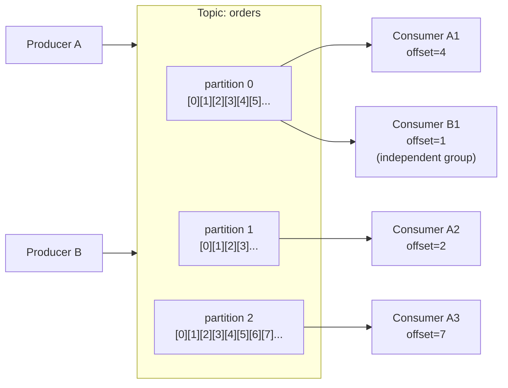
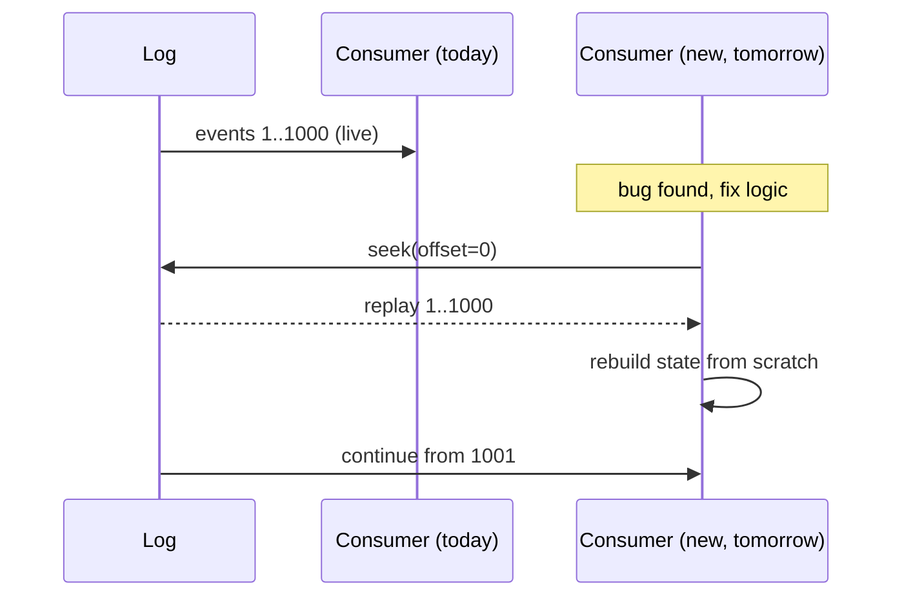

Durable, distributed, partitioned, replayable LOG. The substrate for modern streaming.

```
producer ───► [partition 0: ☐☐☐☐☐☐☐☐☐☐☐...] ──┐
producer ───► [partition 1: ☐☐☐☐☐☐☐...........] ─┼── consumer group A (each partition --> one consumer)
producer ───► [partition 2: ☐☐☐☐☐...............] ─┘
                                                  └── consumer group B (independent offsets)

every box = an event, append only, retained for N days
```

## The Log abstraction
Kreps 2013, *[The Log: What Every Software Engineer Should Know About Real Time Data's Unifying Abstraction](https://engineering.linkedin.com/distributed-systems/log-what-every-software-engineer-should-know-about-real-time-datas-unifying)*.

> One append only log is the universal data structure for distributed systems.

Replaces: queues, ETL, change data capture, pub/sub, replication.

## Properties
- **Append only** - new events at the tail
- **Partitioned** - per topic, hashed by key, parallel scale
- **Replicated** - across brokers, leader + followers
- **Persistent** - retain N days or until log size cap
- **Replayable** - reset consumer offset to reprocess

## Why this matters
- new consumer? Read from offset 0, get full history.
- bug in your pipeline? Fix it, reset offset, replay.
- new use case 6 months later? Subscribe, no re-ingestion.

## Use cases
- event sourcing
- microservice communication
- change data capture (Debezium --> Kafka)
- [[Stream Processing]] input
- [[OpenTelemetry]] transport

! Without Kafka (or Kinesis, Pulsar, etc) you can't do [[Kappa Architecture]]. The log IS the architecture.

## Visual - topic + partitions



## Visual - replay = time travel



## Learn more
- [Apache Kafka](https://kafka.apache.org/) - official
- Kreps 2013: [The Log essay](https://engineering.linkedin.com/distributed-systems/log-what-every-software-engineer-should-know-about-real-time-datas-unifying) - the most important read
- [Confluent Developer - Kafka 101](https://developer.confluent.io/learn-kafka/) - free video course, Tim Berglund
- Kreps et al 2011: [Kafka original paper](https://notes.stephenholiday.com/Kafka.pdf)

