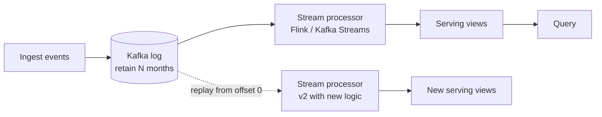
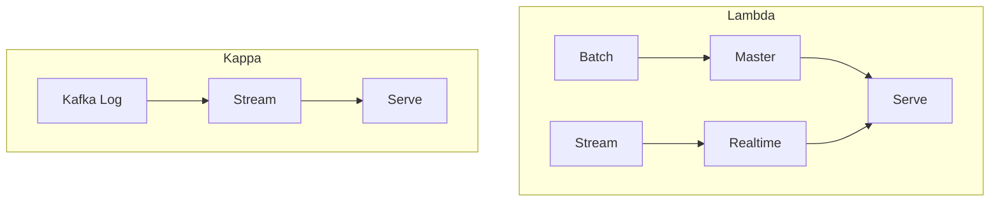

Jay Kreps, 2014. *[Questioning the Lambda Architecture](https://www.oreilly.com/radar/questioning-the-lambda-architecture/).*

Kill the batch layer. Everything is stream.

```
ingest ── raw ──► [Kafka log] ──► stream processor ──► serving
                       │
                       └── reprocess: replay log into a new stream job
```

## Idea
- one [[Kafka]] log = source of truth
- one stream processor (Flink, Kafka Streams, etc) does all transforms
- need to recompute? Spin up a new instance of the processor, replay the log from offset 0
- no separate batch layer

## Why it works
- stream engines got correct enough (exactly once, watermarks, event time)
- log retention got cheap enough (months in Kafka, forever in S3)
- one codebase, one mental model

## vs [[Lambda Architecture]]
| | Lambda | Kappa |
|---|---|---|
| codebases | 2 (batch + stream) | 1 (stream) |
| latency | speed layer = real time | always real time |
| correctness | batch wins eventually | stream is correct |
| ops complexity | high | medium |

## When to NOT do Kappa
- some queries genuinely need full historical scan of structured data --> warehouse + ELT is simpler
- log retention is too expensive at your scale
- regulators want "batch system of record"

! Modern stacks usually do Kappa for fresh data + warehouse for historical analytics. Pragmatic, not pure.

See [[Kafka]] (the substrate), [[Stream Processing]] (the engines).

## Visual



## Visual - vs Lambda



## Learn more
- Kreps 2014: [Questioning the Lambda Architecture](https://www.oreilly.com/radar/questioning-the-lambda-architecture/) - the essay
- Kreps 2013: [The Log](https://engineering.linkedin.com/distributed-systems/log-what-every-software-engineer-should-know-about-real-time-datas-unifying)
- Akidau et al 2015: [The Dataflow Model paper](https://www.vldb.org/pvldb/vol8/p1792-Akidau.pdf) - rigorous treatment of event-time streaming

