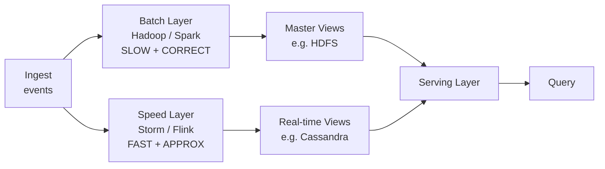
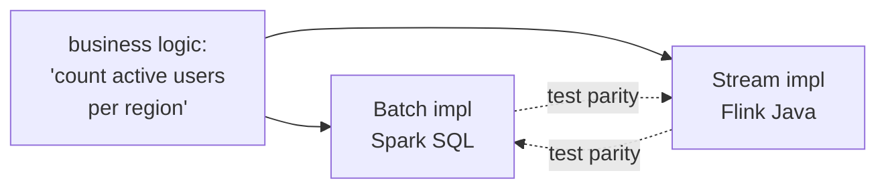

Nathan Marz, ~2011. *How to beat the CAP theorem.*

Two paths from raw data to serving layer.

```
                    ┌──── batch layer ──────┐
                    │  (correct, slow)      │
ingest ── raw ──────┤                       ├── serving layer ── query
                    │                       │
                    └──── speed layer ──────┘
                       (fast, approximate)
```

## Idea
- **Batch layer** runs over ALL data, produces "master view." Correct but high latency.
- **Speed layer** processes only recent data. Real time but approximate.
- **Serving layer** answers queries by merging both.

## Why it existed
- batch ([[Hadoop]] [[MapReduce]]) was fault tolerant but slow
- stream engines (Storm, early Flink) were fast but flaky
- combine both --> correct + fresh

## Why it's contested
- maintain TWO codebases (batch + stream) for the same logic. Maintenance hell.
- testing parity between layers is painful.
- modern stream engines (Flink, Spark Structured Streaming) are reliable enough to handle correctness alone.

## Successor
[[Kappa Architecture]] - one log, one stream processor, replay if you need to recompute. Kreps 2014.

## When Lambda still makes sense
- legacy stack already has a strong batch layer
- compliance / audit requires a separate "system of record" that the batch produces
- batch and stream consumers have wildly different SLAs

See [[Stream Processing]], [[Kafka]].

## Visual


Two paths. Merge at the serving layer.

## Visual - the maintenance pain


Two implementations of the same thing. Parity tests forever.

## Learn more
- Marz 2011: [How to Beat the CAP Theorem](http://nathanmarz.com/blog/how-to-beat-the-cap-theorem.html) - original essay
- Marz + Warren, *Big Data: Principles and best practices* - the Lambda book
- Compare with [[Kappa Architecture]] (Kreps 2014)

