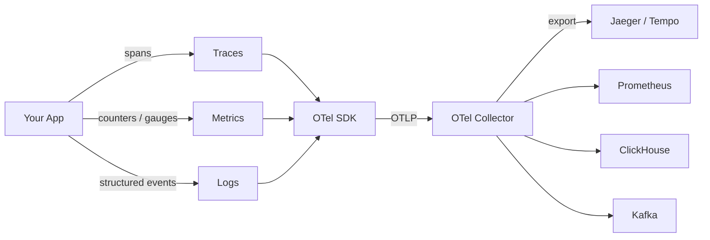
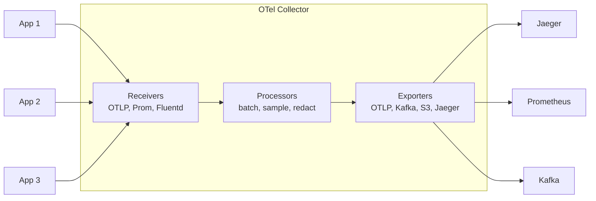

Vendor neutral standard for traces, metrics, and logs. CNCF project. The course's chosen project tech.

```
  application ──── OTel SDK ────► OTLP ─────► OTel Collector ─────► backends
                  (instrument                 (receive, process,    (Jaeger,
                   spans / metrics             batch, route)         Prometheus,
                   / logs)                                           ClickHouse,
                                                                    Tempo, ...)
```

## Three signals
- **Traces** - distributed request paths. A trace = many spans. Span = one unit of work with timing + attributes.
- **Metrics** - numeric measurements over time (counters, histograms, gauges).
- **Logs** - structured event records.

## Why one project
Pre OTel: three separate ecosystems (Jaeger for traces, Prometheus for metrics, Fluentd for logs). OTel unifies SDK, wire format (OTLP), collector.

## OTLP
The portable wire protocol. Course rule from `CLAUDE.md`: export via OTLP, avoid Zipkin/Jaeger exporters unless required.

## Collector
- receivers (OTLP, Prometheus, Fluentd, etc)
- processors (batch, sample, redact)
- exporters (Jaeger, Prometheus, ClickHouse, Kafka, ...)

Topology matters: [[Lambda Architecture]] vs [[Kappa Architecture]] applies here too.

## Origins
- [[Dapper]] (Google 2010) - the tracing paper OTel descends from
- OpenTracing + OpenCensus merged into OpenTelemetry (2019)

## Why it's a Big Data problem
- high cardinality (every request, every span, every label combo)
- high velocity (millions of events per second)
- variety (traces, metrics, logs - three shapes)

Classic [[Velocity]] + [[Variety]] + [[Volume]] hit at once. See [[News Intelligence Platform]] for our project context.

## Visual - the three signals



## Visual - a single trace

```mermaid
gantt
    title One user request, 5 services
    dateFormat X
    axisFormat %L ms
    section frontend
    HTTP /checkout      :a1, 0, 280
    section auth
    validate token      :a2, 10, 30
    section catalog
    GET item            :a3, 40, 60
    section payments
    charge card         :a4, 100, 200
    section email
    send receipt        :a5, 220, 250
```


Each bar = a span. The tree of spans = a trace.

## Visual - collector topology



## Learn more
- [opentelemetry.io](https://opentelemetry.io/) - official
- [OpenTelemetry concepts](https://opentelemetry.io/docs/concepts/) - tour of signals + collector
- [Honeycomb tracing 101](https://www.honeycomb.io/blog/observability-101-tracing-101) - intuition first
- Majors, Fong-Jones, Miranda 2022: [Observability Engineering](https://www.oreilly.com/library/view/observability-engineering/9781492076438/) - O'Reilly book, Ch 1-3 free
- Sigelman 2010: [[Dapper]] - the original tracing paper
- YouTube: search "OpenTelemetry crash course" for animated walkthroughs

