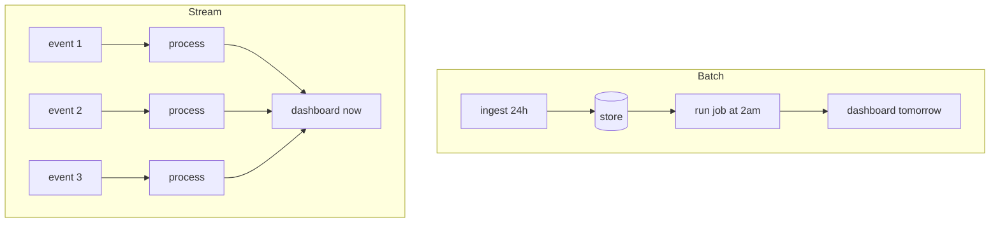

Process data as it arrives, one event at a time (or in micro batches). Opposite of batch.

```
batch:    [accumulate]  ──── run ──── result
                day 1           day 2

stream:   event ─ process ─ result
          event ─ process ─ result
          event ─ process ─ result
          ...
```

## Single source
**Stream processing** = one source, continuous. Examples:
- log lines from a service
- click stream from a website
- telemetry from an OTel agent
- IoT sensor stream

## Multi source
**Complex event processing** = many sources, look for patterns. See [[CEP]].

## Engines
- **Storm** - early, Twitter's project
- **Spark Streaming** - micro batch on top of Spark
- **Flink** - true event streaming, exactly once
- **Kafka Streams** - lightweight, embedded in your app
- **OTel Collector** - processes telemetry streams specifically

## Architectural patterns
- [[Lambda Architecture]] - batch + speed layer
- [[Kappa Architecture]] - stream everything, replay log if you need to recompute
- both depend on [[Kafka]] (or similar durable log) as the substrate

## Use cases (Watson)
- automated stock trading
- credit card fraud detection
- supply chain monitoring
- equipment monitoring (predictive maintenance)
- observability ([[OpenTelemetry]])

! Stream processing is the course technology our team project leans on. See [[News Intelligence Platform]].

## Visual - batch vs stream



## Visual - windowing

```mermaid
gantt
    title Tumbling window (5s) vs Sliding window (5s, slide 2s)
    dateFormat X
    axisFormat %L
    section Tumbling
    W1 : 0, 5
    W2 : 5, 10
    W3 : 10, 15
    section Sliding
    S1 : 0, 5
    S2 : 2, 7
    S3 : 4, 9
    S4 : 6, 11
```



## Learn more
- Akidau et al 2015: [The Dataflow Model paper](https://www.vldb.org/pvldb/vol8/p1792-Akidau.pdf) - watermarks, event-time, windows
- [Apache Flink docs](https://flink.apache.org/) - the gold-standard stream engine
- [Confluent ksqlDB](https://www.confluent.io/product/ksqldb/) - SQL on streams
- O'Reilly: *Streaming Systems* (Akidau, Chernyak, Lax) - the textbook

