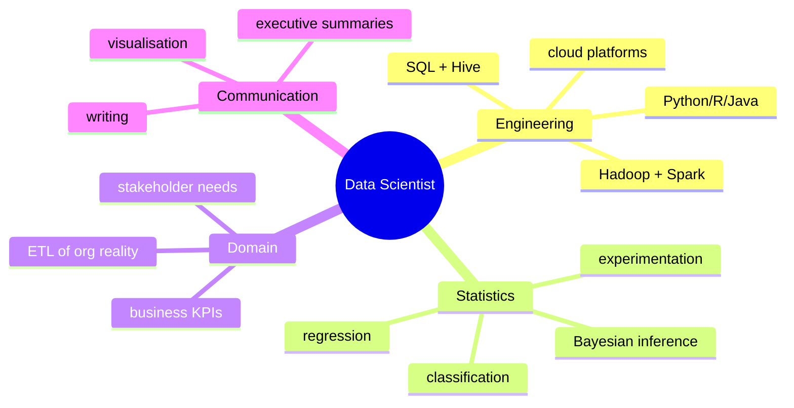
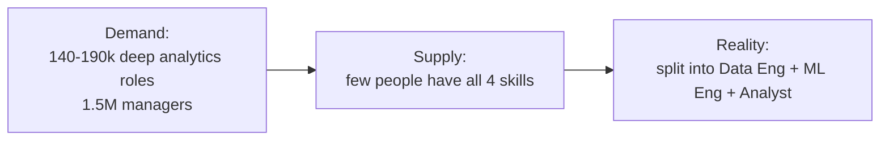

The unicorn role. Watson's "people continuum" for [[Big Data]] orgs.

## Continuum

| Role | Producer / Consumer | Skill mix |
|------|---------------------|-----------|
| Business user | consumer | domain knowledge, use the tool |
| BI analyst | producer (IT side) | enterprise data + tools |
| Business analyst | producer (business side) | business unit domain |
| **Data scientist** | producer | RDBMS + [[Hadoop]] + code (Python / R / Java) + SQL / [[Hive]] + stats + comms |

## Why "sexiest job"
Davenport + Patil, HBR 2012. *Data Scientist: The Sexiest Job of the 21st Century*. Made the title go viral.

## Why it's actually hard to hire
McKinsey 2011 forecast: 140-190k deep analytics talent shortage + 1.5M managers in US alone.

Combined skill set:
- engineering (pipelines, distributed compute)
- statistics (modeling, inference)
- domain knowledge (what the business actually needs)
- communication (translate models into decisions)

! Real teams split the role. Data engineers do pipelines. ML engineers do training + serving. Analysts do business framing. "Full stack data scientist" rare and pricey.

## Visual - skill mix

## Visual - hiring funnel pain

## Learn more
- Davenport + Patil 2012: [Data Scientist: Sexiest Job](https://hbr.org/2012/10/data-scientist-the-sexiest-job-of-the-21st-century)
- McKinsey 2011 report: [Big data: The next frontier](https://www.mckinsey.com/capabilities/mckinsey-digital/our-insights/big-data-the-next-frontier-for-innovation)
- [The data engineer's career path](https://www.startdataengineering.com/) - blog

