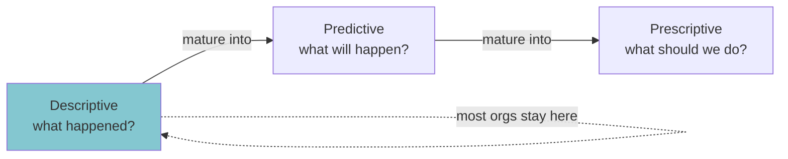
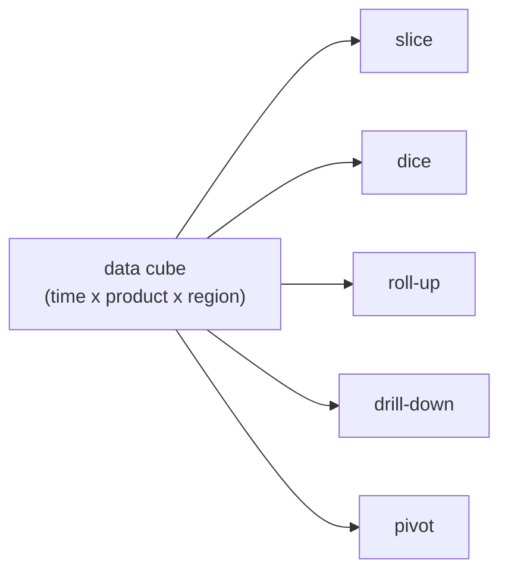

What happened? Rear view mirror.

| | |
|---|---|
| Question | What happened? |
| Analogy | Rear view mirror |
| Examples | Reports, OLAP, dashboards, data viz |

## The workhorse
First and most common analytics. Every org starts here. Most orgs STAY here.

- BI dashboards
- monthly KPI reports
- ad hoc queries ("how many orders last quarter?")
- OLAP cubes (slice, dice, roll up, drill down)

## Where the work happens
- [[Data Warehouse]] - the storage
- [[Columnar Database]] - the engine
- SQL / [[Hive]] - the language
- BI tools (Tableau, PowerBI, Looker, Metabase) - the surface

## Why it's not enough alone
Tells you the past. Doesn't tell you what to do next.

! The ladder is descriptive --> [[Predictive Analytics]] --> [[Prescriptive Analytics]]. Each step requires the prior to be working.

See [[Watson 2014]] for the framing.

## Visual - the ladder

## Visual - OLAP cube

## Learn more
- Wikipedia: [OLAP](https://en.wikipedia.org/wiki/Online_analytical_processing)
- Kimball + Ross, *The Data Warehouse Toolkit* - the textbook
- [Metabase tutorial](https://www.metabase.com/learn) - hands-on BI

