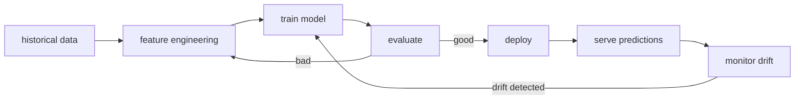

What will happen? Windshield.

| | |
|---|---|
| Question | What WILL happen? |
| Analogy | Windshield |
| Examples | Regression, ML, neural nets, "golden path" analysis |

## How
Train a model on historical data, predict on new data.

- regression - predict a number (next quarter revenue)
- classification - predict a class (will this customer churn?)
- forecasting - predict over time (energy demand next week)
- recommendation - predict preference (next show to watch)

## Where the work happens
- [[Hadoop]] / Spark for training
- Mahout (legacy), scikit, PyTorch, TF for modeling
- model registry + serving layer (MLflow, Vertex, SageMaker)
- monitoring: feature drift, prediction drift, accuracy decay

## Cases ([[Watson 2014]])
- **Target pregnancy model** - 25 features --> trimester prediction
- **Chevron seismic analysis** - 1-in-5 to 1-in-3 oil hit rate
- credit card fraud detection
- predictive maintenance

## Pitfalls
- training data bias --> biased predictions
- model staleness --> retrain regularly
- correlation vs causation - prediction doesn't tell you what TO DO

! Next step up the ladder is [[Prescriptive Analytics]] - which combines prediction WITH constraints and actions.

## Visual - the workflow



## Visual - confusion matrix (classification)

```
              predicted
              ┌────────┬────────┐
              │ Yes    │ No     │
       ┌──────┼────────┼────────┤
actual │ Yes  │ TP ✔   │ FN ✘   │
       ├──────┼────────┼────────┤
       │ No   │ FP ✘   │ TN ✔   │
       └──────┴────────┴────────┘

precision = TP / (TP + FP)   - of those I said Yes, how many were Yes
recall    = TP / (TP + FN)   - of all real Yes, how many did I catch
```

## Learn more
- [3Blue1Brown: Neural Networks](https://www.youtube.com/playlist?list=PLZHQObOWTQDNU6R1_67000Dx_ZCJB-3pi) - the best visual intro
- Goodfellow et al, [Deep Learning book](https://www.deeplearningbook.org/) - free
- [scikit-learn user guide](https://scikit-learn.org/stable/user_guide.html) - tour of classical ML
- [fast.ai practical deep learning](https://course.fast.ai/) - free MOOC

