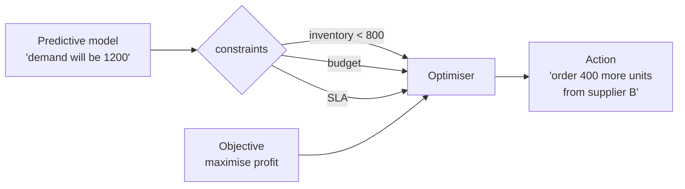
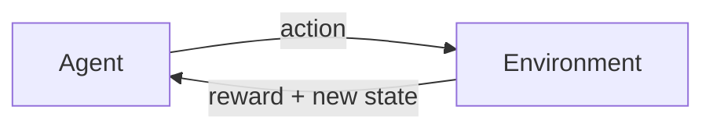

What SHOULD we do? GPS.

| | |
|---|---|
| Question | What should we do? |
| Analogy | GPS |
| Examples | Optimisation, revenue management, math programming, RL |

## How
Combine [[Predictive Analytics|predictions]] + constraints + objective function --> recommended action.

- linear programming (assign workers to shifts)
- integer programming (route trucks)
- revenue management (dynamic pricing)
- reinforcement learning (trading bots, robotics)
- decision trees with actions, not labels

## Examples
- airline ticket pricing
- ride hailing surge pricing
- portfolio optimisation
- supply chain routing
- ad bidding

## Why hardest
- needs working [[Predictive Analytics]] underneath
- needs a clear OBJECTIVE (what are we maximising?)
- needs CONSTRAINTS modelled correctly (or it suggests illegal moves)
- humans often override recommendations - feedback loops required

! Most orgs never reach prescriptive maturity. Watson's success factors (clear business need + culture of fact based decisions) gate this level.

## Visual

## Visual - reinforcement learning loop

## Learn more
- Sutton + Barto, [Reinforcement Learning book (free PDF)](http://incompleteideas.net/book/the-book.html) - the textbook
- [OR-Tools](https://developers.google.com/optimization) - Google's free optimisation toolkit, fun to play with
- [Operations Research at MIT OCW](https://ocw.mit.edu/courses/15-053-optimization-methods-in-management-science-spring-2013/)

