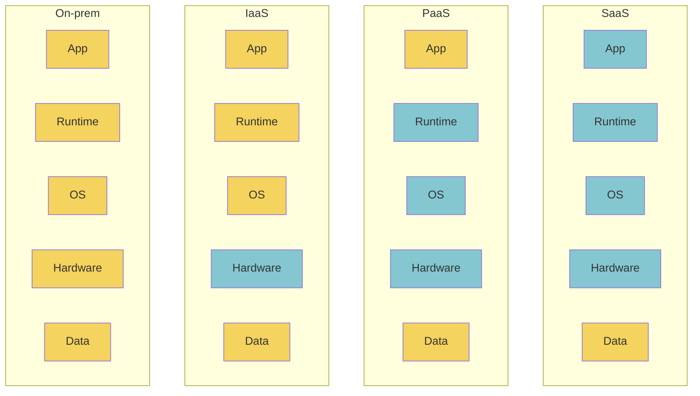
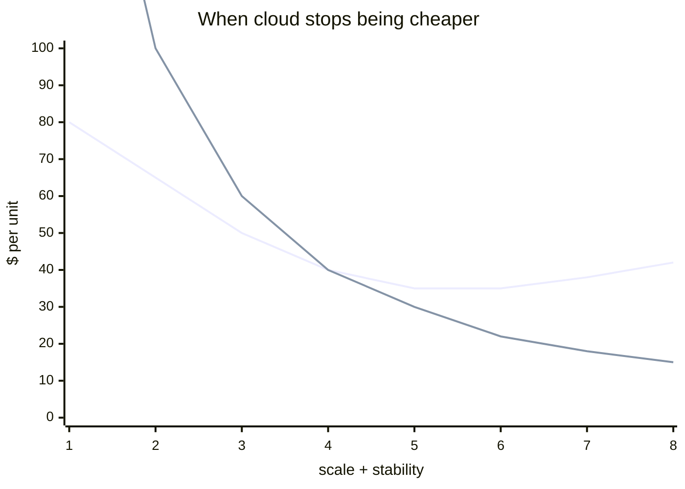

Rent compute + storage from someone else's data centre.

## Three flavours

| | What | Examples |
|---|------|----------|
| **SaaS** | full app, vendor hosts everything | Cognos cloud, Business Objects, Salesforce, Tableau Online |
| **PaaS** | platform, you build the app | Heroku, App Engine, Azure App Service |
| **IaaS** | raw VMs + storage | EC2, GCE, DigitalOcean |

```
       you manage:
       
SaaS:      ░░░░░░░░░░  nothing (just data)
PaaS:      ████░░░░░░  your code
IaaS:      ███████░░░  OS + above
On-prem:   ██████████  everything
```

## Big Data cloud notables
- **Amazon Redshift** (2013) - warehouse in the cloud, $1k/TB/year (then)
- **BigQuery** - serverless warehouse on Google
- **Snowflake** - cross cloud warehouse SaaS
- **Databricks** - Spark + lakehouse SaaS

## Zynga case ([[Watson 2014]])
Launches games on EC2 for unknown demand. Once demand stabilises, moves to in-house "Z Cloud." Started 80/20 EC2 vs Z Cloud, flipped to 20/80.

! Cloud is the ELASTIC layer. On prem is the COMMITTED layer. Hybrid is the norm.

## Cost gotcha
Cloud beats on prem until your usage is large + stable. Then on prem beats cloud. Watch your monthly bill, not just the hourly rate.

## Visual - the responsibility stack


Blue = vendor manages. Yellow = you manage.

## Visual - cost vs scale


Lines cross. After crossover, on-prem is cheaper.

## Learn more
- [Cloud vs on-prem TCO comparison (a16z)](https://a16z.com/the-cost-of-cloud-a-trillion-dollar-paradox/)
- [AWS / GCP / Azure free tiers](https://aws.amazon.com/free/)
- [The serverless tradeoffs (Hellerstein 2019)](https://arxiv.org/abs/1812.03651)

