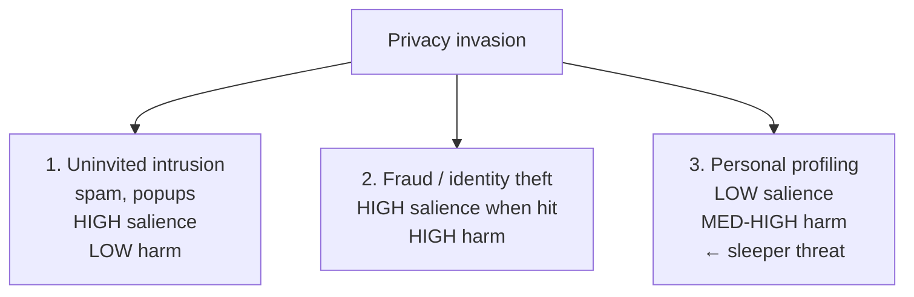
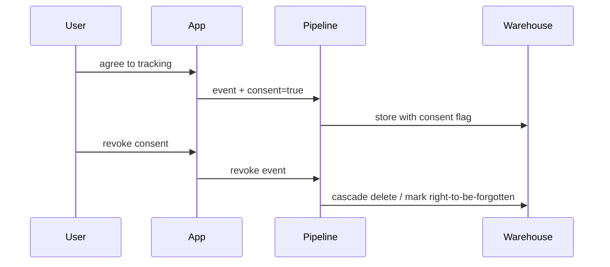

[[Watson 2014]] via Clemons et al 2014. Three kinds of invasion.

| Kind | Salience | Harm |
|------|----------|------|
| Uninvited intrusion (spam, pop ups, robocalls) | high | low |
| Fraud / identity theft | high (when it happens to you) | high |
| Personal profiling for commercial advantage | LOW | medium - high |

## Profiling - the sleeper
Public awareness: low. People shrug at "Google knows what I search."

Concern: rises sharply when people learn what's being done with that data (sold to insurers, used for credit scoring, sold to political campaigns).

## Few regulations bite Internet firms
Watson's call: "consistent, reasonable, transparent, easy to understand" privacy law.

Since the paper:
- **GDPR** (2018, EU) - consent, right to be forgotten, data portability, $$$ fines
- **CCPA** (2018, California) - similar in spirit
- **EU AI Act** (2024) - extends to AI training data

## For Big Data architects
Privacy is now an EA concern, not a legal afterthought.
- data minimisation - don't collect what you don't need
- pseudonymisation - hash identifiers, don't store raw
- access controls + audit logs
- right-to-be-forgotten requires lineage tracking
- consent flags propagate through every system that touches the data

! [[NoSQL]] + [[HDFS]] make data minimisation HARDER. They encourage "ingest everything, figure out later." That collides with GDPR. Modern stacks bake consent + retention into the catalog.

## Visual - the three invasions

## Visual - consent flow

## Learn more
- [GDPR full text (EUR-Lex)](https://eur-lex.europa.eu/legal-content/EN/TXT/?uri=CELEX%3A32016R0679)
- [EU AI Act explainer](https://artificialintelligenceact.eu/)
- [Privacy by Design (Cavoukian)](https://www.ipc.on.ca/wp-content/uploads/Resources/7foundationalprinciples.pdf) - the 7 principles

