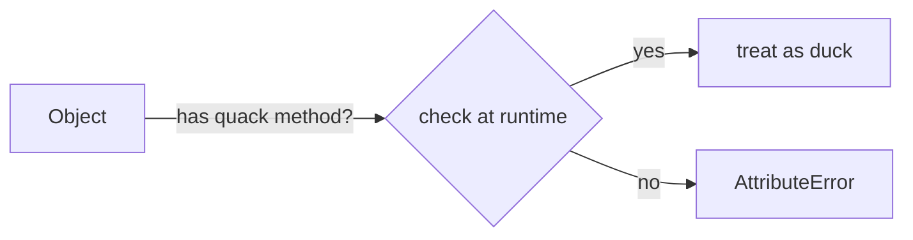
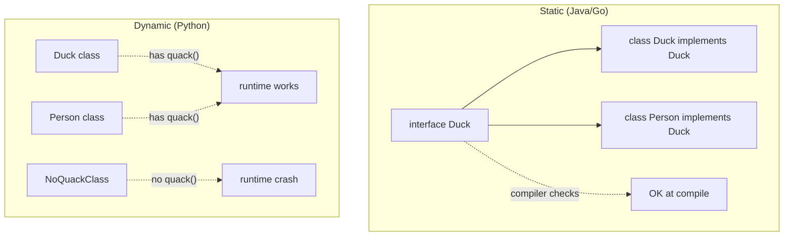

If it walks like a duck and it quacks like a duck then it must be a duck.

Dynamic type checking. Python's default behavior.

```python
class Duck:
    def quack(self): print("quack")

class Person:
    def quack(self): print("i am pretending to be a duck")

def make_it_quack(thing):
    thing.quack()         # works for both - Python does not check the type
```

! No static check. Crashes at runtime if the method is missing.

Pair with [[Polymorphism]] - same interface, different behavior, no inheritance required.

vs static typing (Java, Go, Rust) where the compiler insists you declare an interface up front.

## Visual



## Visual - static vs dynamic dispatch



## Learn more
- Wikipedia: [Duck typing](https://en.wikipedia.org/wiki/Duck_typing)
- [Python ABC + duck typing](https://docs.python.org/3/library/abc.html)
- [Go interfaces (structural)](https://go.dev/tour/methods/9) - static duck typing

